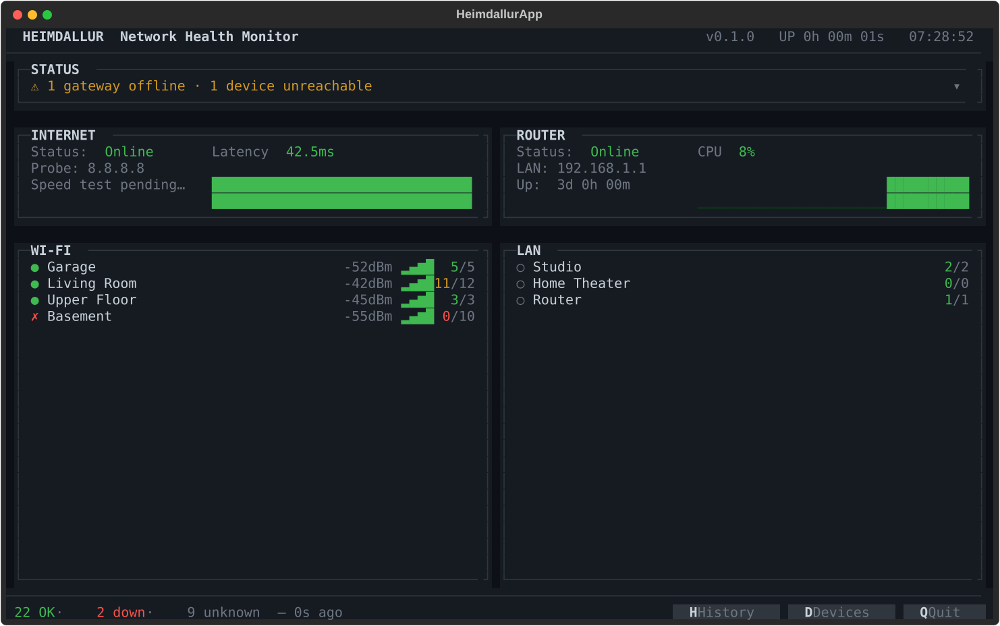

# Heimdallur

> **Pre-alpha — under active development. Not production ready.**

A terminal-based network health monitor designed to run on a Raspberry Pi with an attached display, positioned physically next to your ONT and router.

Heimdallur gives you a persistent, at-a-glance view of your entire home network — ideal for households with many smart home devices where quickly understanding the current state of the network matters.



## What it does

- **Internet health** — latency trending and speed test results (Cloudflare)
- **Router overview** — status, uptime, CPU load
- **Device groups** — organises all monitored devices into groups (WiFi access points, wired LAN segments), showing signal strength and online/offline counts per group
- **Status panel** — single-line summary that expands to list every active fault
- **History screen** — 24h uptime bars per network segment
- **Device list** — full device inventory with live latency and status per device

Faults cascade correctly: if an access point goes offline, its downstream devices are shown as affected rather than individually failed, keeping the signal-to-noise ratio low.

## Intended use

Mount or place a Raspberry Pi with a small display next to your ONT or router. Heimdallur runs as a systemd service and displays continuously. When something feels off — the internet is slow, a group of smart lights stops responding, a gateway goes unreachable — the monitor tells you immediately without having to open a phone app or log into a router UI.

## Stack

- Python 3.12
- [Textual](https://github.com/Textualize/textual) — TUI framework
- [aiosqlite](https://github.com/omnilib/aiosqlite) — async SQLite for history
- [httpx](https://github.com/encode/httpx) — speed tests
- [uv](https://github.com/astral-sh/uv) — package management

## Running locally (mock mode)

```bash
# Install dependencies
make install

# Run with simulated network data (no real pings)
make mock

# Run with hot reload during development
make dev
```

## Configuration

All devices and groups are defined in `heimdallur/config/devices.toml`. Edit this file to match your network topology — groups, access points, and devices.

## Deploying to a Raspberry Pi

```bash
make deploy   # rsyncs to pi@heimdallur.local and restarts the systemd service
make logs     # tail the service log
```

## Status

Pre-alpha. Core monitoring loop, TUI, mock mode, and local history storage are working. Production hardening, real router stats integration, and a proper history screen are in progress.
