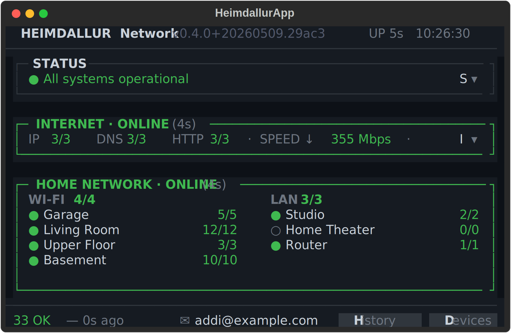

# Heimdallur

> **Pre-alpha — under active development. Not production ready.**

A terminal-based network health monitor designed to run on a Raspberry Pi with an attached display, positioned physically next to your ONT and router.

Heimdallur gives you a persistent, at-a-glance view of your entire home network — ideal for households with many smart home devices where quickly understanding the current state of the network matters.


## What it does

- **Internet health** — IP, DNS, and HTTP reachability checks against multiple targets; latency trending and speed test results (Cloudflare)
- **Home network panel** — router latency, memory usage, and uptime; device groups (WI-FI access points and LAN segments) with per-AP signal strength and online/offline counts
- **Status panel** — single-line summary that expands to list every active fault
- **Incident reports** — emails the home network admin when internet or home network connectivity is restored after an outage; sent via Gmail with a 16-character app password
- **History screen** — 24h uptime bars per network segment
- **Device list** — full device inventory with live latency and status per device

Faults cascade correctly: if an access point goes offline, its downstream devices are shown as affected rather than individually failed, keeping the signal-to-noise ratio low.


## Intended use

Mount or place a Raspberry Pi with a small display next to your ONT or router. Heimdallur runs as a systemd service and displays continuously. When something feels off — the internet is slow, a group of smart lights stops responding, a gateway goes unreachable — the monitor tells you immediately without having to open a phone app or log into a router UI.

## Stack

- Python 3.12
- [Textual](https://github.com/Textualize/textual) — TUI framework
- [textual-serve](https://github.com/Textualize/textual-serve) — serve TUI in browser via xterm.js
- [aiosqlite](https://github.com/omnilib/aiosqlite) — async SQLite for history
- [httpx](https://github.com/encode/httpx) — speed tests
- [uv](https://github.com/astral-sh/uv) — package management

## Running locally (mock mode)

```bash
# Install dependencies
make install

# Run with simulated network data (no real pings)
make mock

# Run with hot reload during development
make dev

# Serve in the browser (mock mode) — opens at http://localhost:8080
make web-mock
```

## Web UI

Heimdallur can be served in any browser on the local network via
[textual-serve](https://github.com/Textualize/textual-serve), which renders
the full interactive TUI as an xterm.js terminal in the browser. No code
changes are needed — the same app runs both on the Pi display and in the
browser.

```bash
# On the Pi — serves on all interfaces at port 8080
make web          # production (real probes)
make web-mock     # mock mode  (no real pings)
```

Open `http://heimdallur.local:8080` from any device on the local network.
All keyboard shortcuts (`i`, `r`, `n`, `h`, `d`, `q`) work in the browser.

> **Note:** textual-serve renders a terminal in the browser, not a native
> web page. It works well on desktop browsers; mobile support is limited.

## Configuration

All devices and groups are defined in `heimdallur/config/network.toml`. Edit this file to match your network topology — groups, access points, and devices.

## Notifications

When an outage ends — internet or home network going from offline back to online — Heimdallur can automatically email an incident report to the home network admin. Add the following to `network.toml`:

```toml
[contacts]
home_network_admin_email = "you@example.com"   # who receives the report

[notification_email_gmail]
sender_email = "heimdallur.alerts@gmail.com"   # Gmail address to send from
app_password = "xxxx xxxx xxxx xxxx"           # 16-char Gmail app password
```

To generate a Gmail app password: **Google Account → Security → 2-Step Verification → App passwords**.

The footer shows whether notifications are configured — `✉ you@example.com` when active, `✉  no email configured` when not. Emails fire on recovery, not during the outage, so a full internet outage will still trigger a report once connectivity is restored.



## Deploying to a Raspberry Pi

```bash
make deploy   # rsyncs to pi@heimdallur.local and restarts the systemd service
make logs     # tail the service log
```

### Console font size

Heimdallur is designed to fill an 800×480 display (e.g. HyperPixel 4") using a large terminal font so the status is legible from across the room. The right font depends on your display resolution:

| Display | Target size | Font |
|---|---|---|
| 800×480 | ~66×20 | Terminus 12×24 |
| 1024×600 | ~80×24 | Terminus 12×24 |
| 1280×800 | ~100×30 | Terminus 12×24 |

To set the console font on the Pi, edit `/etc/default/console-setup`:

```
FONTFACE="Terminus"
FONTSIZE="12x24"
```

Then apply without rebooting:

```bash
sudo setupcon
```

To verify the terminal dimensions after the font change:

```bash
stty -F /dev/tty1 size   # prints rows cols, e.g. "20 66"
```

The `terminus-font` package must be installed (`sudo apt install terminus-font`).

---

## Running in production

### Keeping the application up to date

Heimdallur ships a systemd timer that checks the public GitHub repo for updates once an hour and applies them automatically. Install it once after the initial deploy:

```bash
# On the Pi
sudo cp /opt/heimdallur/scripts/heimdallur-update.service /etc/systemd/system/
sudo cp /opt/heimdallur/scripts/heimdallur-update.timer   /etc/systemd/system/
sudo systemctl daemon-reload
sudo systemctl enable --now heimdallur-update.timer
```

When a new commit lands on `main` the timer will:
1. `git pull --ff-only`
2. `uv sync --no-dev`
3. `systemctl restart heimdallur`

All activity is logged to the systemd journal under the `heimdallur-update` identifier:

```bash
journalctl -t heimdallur-update -f
```

To trigger an immediate update without waiting for the timer:

```bash
sudo systemctl start heimdallur-update
```

The footer shows the running version as `v0.4.0+20260507.d40c034` — date and git hash — so you can identify the exact commit at a glance and match it against the GitHub commit list without running any commands.

---

### Updating device configuration

All devices and groups are defined in `heimdallur/config/network.toml`. On a live Pi you can edit this file directly (or copy a new version over SSH) and then restart the service:

```bash
# Validate before applying
python /opt/heimdallur/scripts/validate-config.py /path/to/new-network.toml

# Apply
cp /path/to/new-network.toml /opt/heimdallur/heimdallur/config/network.toml
sudo systemctl restart heimdallur
```

The validator (`scripts/validate-config.py`) checks TOML syntax, required fields, IP address validity, duplicate IPs, and that every device references a defined group. It exits 0 on success, 1 on any error, so it is safe to use in automated workflows.

---

### Agent / automation access

Heimdallur writes a markdown snapshot of its full current state to:

```
~/.local/share/heimdallur/status.md
```

This file is rewritten after every 30-second probe cycle. An agent with SSH access can read the current network state instantly without running a fresh probe:

```bash
ssh pi@heimdallur.local "cat ~/.local/share/heimdallur/status.md"
```

To force a fresh probe and get the result directly:

```bash
ssh pi@heimdallur.local "cd /opt/heimdallur && uv run python -m heimdallur --mode report"
```

See [`SKILL.md`](SKILL.md) for the full agent skill reference — status queries, config updates, service management, and the complete file reference.

---

## Status

Pre-alpha. Core monitoring loop, TUI, mock mode, and local history storage are working. Production hardening, real router stats integration, and a proper history screen are in progress.
