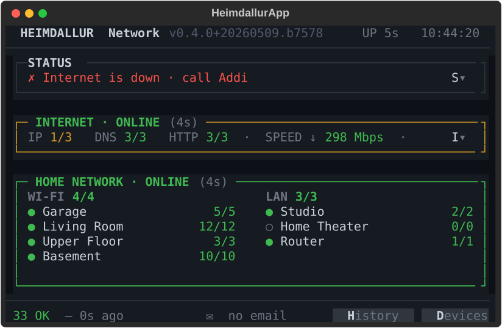
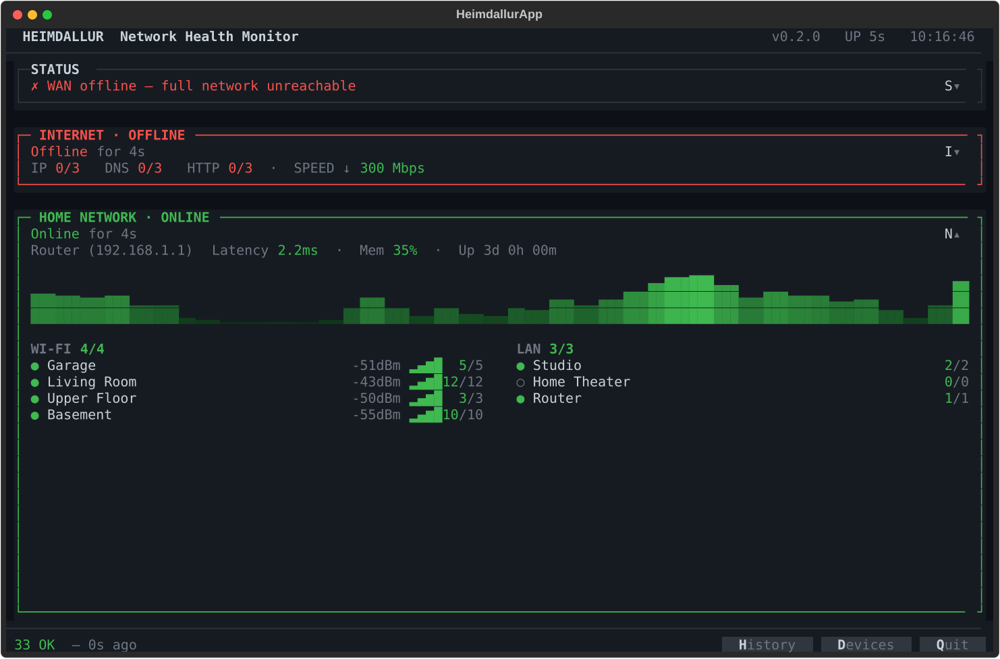

# Heimdallur Output Formats

> Auto-generated by `scripts/capture_all.py` — do not edit manually.

Heimdallur has three output modes:

| Mode | Command | Description |
|------|---------|-------------|
| `tui` | `heimdallur` | Interactive Textual dashboard (default) |
| `status` | `heimdallur --mode status` | Single-pass Rich console output |
| `report` | `heimdallur --mode report` | Markdown snapshot written to `~/.local/share/heimdallur/status.md` |

All outputs below are generated from mock data via the scenario files in
`heimdallur/mock/scenarios/`.

---

## TUI Screenshots (`--mode tui`)

The interactive dashboard. Press `i` / `n` to expand panels,
`h` for history, `d` for devices, `q` to quit.

### Internet degraded

|  |
|:---:|

### Internet offline

|  |
|:---:|

---

## Status Output (`--mode status`)

Single-pass Rich console render — no TUI, no file written. Useful for
scripts, cron jobs, or a quick terminal check.

```
NETWATCH_MOCK=1 heimdallur --mode status
```

### Internet degraded

```text

HEIMDALLUR  12:52:02

                              
   INTERNET         ~  77ms   
   ROUTER           ✓  1ms    
                              
Access Points
  ✓  2ms  WiFi Garage
  ✓  1ms  WiFi Living Room
  ✓  5ms  WiFi Upper Floor
  ✓  2ms  WiFi Basement

All monitored devices OK

33 monitored  ·  33 OK  ·  0 down
```

### Internet offline

```text

HEIMDALLUR  12:52:02

                                 
   INTERNET         ✗  timeout   
   ROUTER           ✓  3ms       
                                 
Access Points
  ✓  1ms  WiFi Garage
  ✓  2ms  WiFi Living Room
  ✓  3ms  WiFi Upper Floor
  ✓  2ms  WiFi Basement

PROBLEMS
  ✗  WAN offline — full network unreachable

33 monitored  ·  33 OK  ·  0 down
```

---

## Markdown Report (`--mode report`)

Self-contained markdown snapshot. Written to
`~/.local/share/heimdallur/status.md` and printed to stdout.
The TUI also rewrites this file after every probe cycle.

```
NETWATCH_MOCK=1 heimdallur --mode report
```

<details>
<summary><strong>Internet degraded</strong></summary>

# Heimdallur Network Status

**Probed:** 2026-05-09 12:52:02 UTC  |  **Interval:** 30s

## Summary

⚠️  1 issue(s) detected — 33 / 33 devices online

- WAN offline — full network unreachable

---

## Internet

**Status:** ❌ UNREACHABLE  |  **Latency (ONT):** 114 ms avg  |  **Loss:** 0%

### IP Reachability

| Target | Status | Latency |
|--------|--------|---------|
| Cloudflare (1.1.1.1) | ❌ unreachable | 162 ms |
| Google (8.8.8.8) | ❌ unreachable | 117 ms |
| Quad9 (9.9.9.9) | ❌ unreachable | 111 ms |

### DNS

| Resolver | Status | Lookup |
|----------|--------|--------|
| Cloudflare (cloudflare.com) | ✅ ok | 97 ms |
| Google (google.com) | ✅ ok | 109 ms |
| Quad9 (quad9.net) | ✅ ok | 116 ms |

### HTTP

| Endpoint | Status | TTFB | Total |
|----------|--------|------|-------|
| Cloudflare | ✅ ok | 337 ms | 397 ms |
| Google | ✅ ok | 399 ms | 471 ms |
| Microsoft | ✅ ok | 286 ms | 350 ms |

**Speed test:** ↓ 447 Mbps  |  ping 24 ms  *(0s ago)*

---

## Router

**Status:** ✅ HEALTHY  |  **Latency:** 1 ms
**CPU:** 6%  |  **Memory:** 34%  |  **Uptime:** 3d

---

## Groups

### WiFi Garage  |  2.4GHz  ch 11

**Gateway `192.168.1.95`:** ✅ 5 ms  |  **Clients:** 2

**Devices:** 4 / 4 online

| Device | IP | Status | Latency |
|--------|----|--------|---------|
| Rafmagnsmaelir 1-fasa | `192.168.1.100` | ✅ healthy | 5 ms |
| Rafmagnsmaelir 3-fasa | `192.168.1.101` | ✅ healthy | 3 ms |
| Bílskúrshurð | `192.168.1.102` | ✅ healthy | 2 ms |
| Bílskúrsljós | `192.168.1.103` | ✅ healthy | 4 ms |

### WiFi Living Room  |  5GHz  ch 36

**Gateway `192.168.1.44`:** ✅ 2 ms  |  **Clients:** 8

**Devices:** 11 / 11 online

| Device | IP | Status | Latency |
|--------|----|--------|---------|
| Inngangur ljós | `192.168.1.110` | ✅ healthy | 5 ms |
| Gestasnyrtingur ljós | `192.168.1.111` | ✅ healthy | 3 ms |
| Eldhús efri ljós | `192.168.1.112` | ✅ healthy | 2 ms |
| Eldhús neðri ljós | `192.168.1.113` | ✅ healthy | 3 ms |
| Stofa ljós 1 | `192.168.1.114` | ✅ healthy | 2 ms |
| Stofa ljós 2 | `192.168.1.115` | ✅ healthy | 4 ms |
| Stofa ljós 3 | `192.168.1.116` | ✅ healthy | 4 ms |
| Kjallaragang ljós | `192.168.1.117` | ✅ healthy | 5 ms |
| Útiljós framhlið | `192.168.1.118` | ✅ healthy | 4 ms |
| Plöntuljós | `192.168.1.119` | ✅ healthy | 3 ms |
| Kaffivél | `192.168.1.219` | ✅ healthy | 3 ms |

### WiFi Upper Floor  |  5GHz  ch 44

**Gateway `192.168.1.43`:** ✅ 2 ms  |  **Clients:** 6

**Devices:** 2 / 2 online

| Device | IP | Status | Latency |
|--------|----|--------|---------|
| Baðherbergi LED | `192.168.1.130` | ✅ healthy | 3 ms |
| Gólfahitun | `192.168.1.131` | ✅ healthy | 1 ms |

### WiFi Basement  |  2.4GHz  ch 6

**Gateway `192.168.1.45`:** ✅ 5 ms  |  **Clients:** 8

**Devices:** 9 / 9 online

| Device | IP | Status | Latency |
|--------|----|--------|---------|
| Svefnherbergi ljós 1 | `192.168.1.140` | ✅ healthy | 4 ms |
| Svefnherbergi ljós 2 | `192.168.1.141` | ✅ healthy | 3 ms |
| Baðherbergi ljós | `192.168.1.142` | ✅ healthy | 1 ms |
| Kvikmyndaherbergi | `192.168.1.143` | ✅ healthy | 2 ms |
| Þvottavél blásari | `192.168.1.144` | ✅ healthy | 2 ms |
| Þvottaherbergi ljós | `192.168.1.145` | ✅ healthy | 5 ms |
| Geymsla ljós | `192.168.1.146` | ✅ healthy | 2 ms |
| Garðljós | `192.168.1.214` | ✅ healthy | 3 ms |
| Garðtenglar | `192.168.1.148` | ✅ healthy | 2 ms |

### LAN Studio

**Devices:** 2 / 2 online

| Device | IP | Status | Latency |
|--------|----|--------|---------|
| Stúdíóbúnaður | `192.168.1.132` | ✅ healthy | 2 ms |
| Home Assistant | `192.168.1.64` | ✅ healthy | 4 ms |

### LAN Home Theater

**Devices:** 0 / 0 online

### LAN Router

**Devices:** 1 / 1 online

| Device | IP | Status | Latency |
|--------|----|--------|---------|
| Unifi Controller | `192.168.1.151` | ✅ healthy | 4 ms |

---

## All Devices

| Device | IP | Group | Status | Latency |
|--------|----|-------|--------|---------|
| Rafmagnsmaelir 1-fasa | `192.168.1.100` | WiFi Garage | ✅ healthy | 5 ms |
| Rafmagnsmaelir 3-fasa | `192.168.1.101` | WiFi Garage | ✅ healthy | 3 ms |
| Bílskúrshurð | `192.168.1.102` | WiFi Garage | ✅ healthy | 2 ms |
| Bílskúrsljós | `192.168.1.103` | WiFi Garage | ✅ healthy | 4 ms |
| Inngangur ljós | `192.168.1.110` | WiFi Living Room | ✅ healthy | 5 ms |
| Gestasnyrtingur ljós | `192.168.1.111` | WiFi Living Room | ✅ healthy | 3 ms |
| Eldhús efri ljós | `192.168.1.112` | WiFi Living Room | ✅ healthy | 2 ms |
| Eldhús neðri ljós | `192.168.1.113` | WiFi Living Room | ✅ healthy | 3 ms |
| Stofa ljós 1 | `192.168.1.114` | WiFi Living Room | ✅ healthy | 2 ms |
| Stofa ljós 2 | `192.168.1.115` | WiFi Living Room | ✅ healthy | 4 ms |
| Stofa ljós 3 | `192.168.1.116` | WiFi Living Room | ✅ healthy | 4 ms |
| Kjallaragang ljós | `192.168.1.117` | WiFi Living Room | ✅ healthy | 5 ms |
| Útiljós framhlið | `192.168.1.118` | WiFi Living Room | ✅ healthy | 4 ms |
| Plöntuljós | `192.168.1.119` | WiFi Living Room | ✅ healthy | 3 ms |
| Kaffivél | `192.168.1.219` | WiFi Living Room | ✅ healthy | 3 ms |
| Baðherbergi LED | `192.168.1.130` | WiFi Upper Floor | ✅ healthy | 3 ms |
| Gólfahitun | `192.168.1.131` | WiFi Upper Floor | ✅ healthy | 1 ms |
| Stúdíóbúnaður | `192.168.1.132` | LAN Studio | ✅ healthy | 2 ms |
| Home Assistant | `192.168.1.64` | LAN Studio | ✅ healthy | 4 ms |
| Unifi Controller | `192.168.1.151` | LAN Router | ✅ healthy | 4 ms |
| Svefnherbergi ljós 1 | `192.168.1.140` | WiFi Basement | ✅ healthy | 4 ms |
| Svefnherbergi ljós 2 | `192.168.1.141` | WiFi Basement | ✅ healthy | 3 ms |
| Baðherbergi ljós | `192.168.1.142` | WiFi Basement | ✅ healthy | 1 ms |
| Kvikmyndaherbergi | `192.168.1.143` | WiFi Basement | ✅ healthy | 2 ms |
| Þvottavél blásari | `192.168.1.144` | WiFi Basement | ✅ healthy | 2 ms |
| Þvottaherbergi ljós | `192.168.1.145` | WiFi Basement | ✅ healthy | 5 ms |
| Geymsla ljós | `192.168.1.146` | WiFi Basement | ✅ healthy | 2 ms |
| Garðljós | `192.168.1.214` | WiFi Basement | ✅ healthy | 3 ms |
| Garðtenglar | `192.168.1.148` | WiFi Basement | ✅ healthy | 2 ms |

---

*Generated by Heimdallur · DB: `~/.local/share/heimdallur/events.db`*

</details>

<details>
<summary><strong>Internet offline</strong></summary>

# Heimdallur Network Status

**Probed:** 2026-05-09 12:52:02 UTC  |  **Interval:** 30s

## Summary

⚠️  1 issue(s) detected — 33 / 33 devices online

- WAN offline — full network unreachable

---

## Internet

**Status:** ❌ UNREACHABLE  |  **Latency (ONT):** — avg  |  **Loss:** 100%

### IP Reachability

| Target | Status | Latency |
|--------|--------|---------|
| Cloudflare (1.1.1.1) | ❌ unreachable | — |
| Google (8.8.8.8) | ❌ unreachable | — |
| Quad9 (9.9.9.9) | ❌ unreachable | — |

### DNS

| Resolver | Status | Lookup |
|----------|--------|--------|
| Cloudflare (cloudflare.com) | ❌ fail | — |
| Google (google.com) | ❌ fail | — |
| Quad9 (quad9.net) | ❌ fail | — |

### HTTP

| Endpoint | Status | TTFB | Total |
|----------|--------|------|-------|
| Cloudflare | ❌ fail | — | — |
| Google | ❌ fail | — | — |
| Microsoft | ❌ fail | — | — |

**Speed test:** ↓ 218 Mbps  |  ping 23 ms  *(0s ago)*

---

## Router

**Status:** ✅ HEALTHY  |  **Latency:** 2 ms
**CPU:** 18%  |  **Memory:** 51%  |  **Uptime:** 3d

---

## Groups

### WiFi Garage  |  2.4GHz  ch 11

**Gateway `192.168.1.95`:** ✅ 2 ms  |  **Clients:** 3

**Devices:** 4 / 4 online

| Device | IP | Status | Latency |
|--------|----|--------|---------|
| Rafmagnsmaelir 1-fasa | `192.168.1.100` | ✅ healthy | 2 ms |
| Rafmagnsmaelir 3-fasa | `192.168.1.101` | ✅ healthy | 3 ms |
| Bílskúrshurð | `192.168.1.102` | ✅ healthy | 4 ms |
| Bílskúrsljós | `192.168.1.103` | ✅ healthy | 4 ms |

### WiFi Living Room  |  5GHz  ch 36

**Gateway `192.168.1.44`:** ✅ 4 ms  |  **Clients:** 9

**Devices:** 11 / 11 online

| Device | IP | Status | Latency |
|--------|----|--------|---------|
| Inngangur ljós | `192.168.1.110` | ✅ healthy | 1 ms |
| Gestasnyrtingur ljós | `192.168.1.111` | ✅ healthy | 3 ms |
| Eldhús efri ljós | `192.168.1.112` | ✅ healthy | 3 ms |
| Eldhús neðri ljós | `192.168.1.113` | ✅ healthy | 3 ms |
| Stofa ljós 1 | `192.168.1.114` | ✅ healthy | 2 ms |
| Stofa ljós 2 | `192.168.1.115` | ✅ healthy | 4 ms |
| Stofa ljós 3 | `192.168.1.116` | ✅ healthy | 1 ms |
| Kjallaragang ljós | `192.168.1.117` | ✅ healthy | 1 ms |
| Útiljós framhlið | `192.168.1.118` | ✅ healthy | 1 ms |
| Plöntuljós | `192.168.1.119` | ✅ healthy | 3 ms |
| Kaffivél | `192.168.1.219` | ✅ healthy | 3 ms |

### WiFi Upper Floor  |  5GHz  ch 44

**Gateway `192.168.1.43`:** ✅ 3 ms  |  **Clients:** 7

**Devices:** 2 / 2 online

| Device | IP | Status | Latency |
|--------|----|--------|---------|
| Baðherbergi LED | `192.168.1.130` | ✅ healthy | 5 ms |
| Gólfahitun | `192.168.1.131` | ✅ healthy | 3 ms |

### WiFi Basement  |  2.4GHz  ch 6

**Gateway `192.168.1.45`:** ✅ 4 ms  |  **Clients:** 11

**Devices:** 9 / 9 online

| Device | IP | Status | Latency |
|--------|----|--------|---------|
| Svefnherbergi ljós 1 | `192.168.1.140` | ✅ healthy | 3 ms |
| Svefnherbergi ljós 2 | `192.168.1.141` | ✅ healthy | 2 ms |
| Baðherbergi ljós | `192.168.1.142` | ✅ healthy | 3 ms |
| Kvikmyndaherbergi | `192.168.1.143` | ✅ healthy | 3 ms |
| Þvottavél blásari | `192.168.1.144` | ✅ healthy | 3 ms |
| Þvottaherbergi ljós | `192.168.1.145` | ✅ healthy | 5 ms |
| Geymsla ljós | `192.168.1.146` | ✅ healthy | 4 ms |
| Garðljós | `192.168.1.214` | ✅ healthy | 3 ms |
| Garðtenglar | `192.168.1.148` | ✅ healthy | 2 ms |

### LAN Studio

**Devices:** 2 / 2 online

| Device | IP | Status | Latency |
|--------|----|--------|---------|
| Stúdíóbúnaður | `192.168.1.132` | ✅ healthy | 2 ms |
| Home Assistant | `192.168.1.64` | ✅ healthy | 3 ms |

### LAN Home Theater

**Devices:** 0 / 0 online

### LAN Router

**Devices:** 1 / 1 online

| Device | IP | Status | Latency |
|--------|----|--------|---------|
| Unifi Controller | `192.168.1.151` | ✅ healthy | 3 ms |

---

## All Devices

| Device | IP | Group | Status | Latency |
|--------|----|-------|--------|---------|
| Rafmagnsmaelir 1-fasa | `192.168.1.100` | WiFi Garage | ✅ healthy | 2 ms |
| Rafmagnsmaelir 3-fasa | `192.168.1.101` | WiFi Garage | ✅ healthy | 3 ms |
| Bílskúrshurð | `192.168.1.102` | WiFi Garage | ✅ healthy | 4 ms |
| Bílskúrsljós | `192.168.1.103` | WiFi Garage | ✅ healthy | 4 ms |
| Inngangur ljós | `192.168.1.110` | WiFi Living Room | ✅ healthy | 1 ms |
| Gestasnyrtingur ljós | `192.168.1.111` | WiFi Living Room | ✅ healthy | 3 ms |
| Eldhús efri ljós | `192.168.1.112` | WiFi Living Room | ✅ healthy | 3 ms |
| Eldhús neðri ljós | `192.168.1.113` | WiFi Living Room | ✅ healthy | 3 ms |
| Stofa ljós 1 | `192.168.1.114` | WiFi Living Room | ✅ healthy | 2 ms |
| Stofa ljós 2 | `192.168.1.115` | WiFi Living Room | ✅ healthy | 4 ms |
| Stofa ljós 3 | `192.168.1.116` | WiFi Living Room | ✅ healthy | 1 ms |
| Kjallaragang ljós | `192.168.1.117` | WiFi Living Room | ✅ healthy | 1 ms |
| Útiljós framhlið | `192.168.1.118` | WiFi Living Room | ✅ healthy | 1 ms |
| Plöntuljós | `192.168.1.119` | WiFi Living Room | ✅ healthy | 3 ms |
| Kaffivél | `192.168.1.219` | WiFi Living Room | ✅ healthy | 3 ms |
| Baðherbergi LED | `192.168.1.130` | WiFi Upper Floor | ✅ healthy | 5 ms |
| Gólfahitun | `192.168.1.131` | WiFi Upper Floor | ✅ healthy | 3 ms |
| Stúdíóbúnaður | `192.168.1.132` | LAN Studio | ✅ healthy | 2 ms |
| Home Assistant | `192.168.1.64` | LAN Studio | ✅ healthy | 3 ms |
| Unifi Controller | `192.168.1.151` | LAN Router | ✅ healthy | 3 ms |
| Svefnherbergi ljós 1 | `192.168.1.140` | WiFi Basement | ✅ healthy | 3 ms |
| Svefnherbergi ljós 2 | `192.168.1.141` | WiFi Basement | ✅ healthy | 2 ms |
| Baðherbergi ljós | `192.168.1.142` | WiFi Basement | ✅ healthy | 3 ms |
| Kvikmyndaherbergi | `192.168.1.143` | WiFi Basement | ✅ healthy | 3 ms |
| Þvottavél blásari | `192.168.1.144` | WiFi Basement | ✅ healthy | 3 ms |
| Þvottaherbergi ljós | `192.168.1.145` | WiFi Basement | ✅ healthy | 5 ms |
| Geymsla ljós | `192.168.1.146` | WiFi Basement | ✅ healthy | 4 ms |
| Garðljós | `192.168.1.214` | WiFi Basement | ✅ healthy | 3 ms |
| Garðtenglar | `192.168.1.148` | WiFi Basement | ✅ healthy | 2 ms |

---

*Generated by Heimdallur · DB: `~/.local/share/heimdallur/events.db`*

</details>
