# UI States

All snapshots are generated from mock data via `scripts/capture_all.py` and committed to `docs/snapshots/`. The Web UI, status output, and markdown report samples for each base network state are injected automatically by the same script.

---

## Status screen

The main view, always visible. Three panels stack vertically: Internet, Home Network, and a collapsible status banner at the top. Each panel shows a bold online/offline indicator with a live duration ticker and a rolling-average summary line. Click a panel or press the shortcut key to expand it for sparklines and detail.

---

### All healthy

Everything reachable — internet, router, access points, and all devices. The status banner is collapsed since there is nothing to report.

| 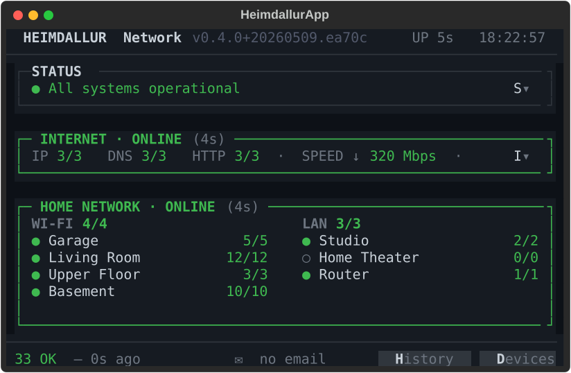 |
|:---:|

<!-- generated:all_healthy:start -->
<details>
<summary>Web UI (<code>make web</code>)</summary>

| 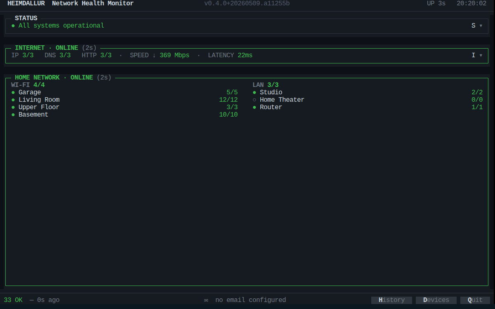 |
|:---:|

</details>

<details>
<summary>Status output (<code>--mode status</code>)</summary>

```text

HEIMDALLUR  2026-05-31 20:47:20 UTC

INTERNET  ✓ Online  32ms  excellent
  IP 3/3  ·  DNS 3/3  ·  HTTP 3/3
  All paths healthy
  ↓ 438 Mbps  ·  ping 12 ms  (0s ago)

HOME NETWORK
  ROUTER  ✓ Online  3ms
  ✓ Online  1ms  WiFi Garage
  ✓ Online  2ms  WiFi Main Floor
  ✓ Online  5ms  WiFi Upper Floor
  ✓ Online  2ms  WiFi Lower Floor
  LAN  LAN Office
  LAN  LAN Media
  LAN  LAN Router

All monitored devices OK

33 monitored  ·  33 OK  ·  0 down
```

</details>

<details>
<summary>Markdown report (<code>--mode report</code>)</summary>

# Heimdallur Network Status

**Probed:** 2026-05-31 20:47:20 UTC  |  **Interval:** 30s

## Summary

✅ All systems healthy — 33 / 33 devices online

---

## Internet

**Status:** ✅ HEALTHY  |  **Latency (ONT):** 21 ms avg (excellent)  |  **Loss:** 0%

### IP Reachability

| Target | Status | Latency |
|--------|--------|---------|
| Cloudflare (1.1.1.1) | ✅ healthy | 20 ms |
| Google (8.8.8.8) | ✅ healthy | 35 ms |
| Quad9 (9.9.9.9) | ✅ healthy | 13 ms |

### DNS

| Resolver | Status | Lookup |
|----------|--------|--------|
| Cloudflare (cloudflare.com) | ✅ Online | 2 ms |
| Google (google.com) | ✅ Online | 9 ms |
| Quad9 (quad9.net) | ✅ Online | 10 ms |

### HTTP

| Endpoint | Status | TTFB | Total |
|----------|--------|------|-------|
| Cloudflare | ✅ Online | 47 ms | 62 ms |
| Google | ✅ Online | 65 ms | 72 ms |
| Microsoft | ✅ Online | 69 ms | 82 ms |

**Speed test:** ↓ 412 Mbps  |  ping 20 ms  *(0s ago)*

---

## Home Network

### Router

**Status:** ✅ HEALTHY  |  **Latency:** 3 ms
**CPU:** 22%  |  **Memory:** 44%  |  **Uptime:** 3d

### Groups

#### WiFi Garage

**Gateway `192.0.2.25`:** ✅ 5 ms

**Devices:** 4 / 4 online

| Device | IP | Status | Latency |
|--------|----|--------|---------|
| Garage Door Controller | `192.0.2.100` | ✅ healthy | 2 ms |
| Garage Light | `192.0.2.101` | ✅ healthy | 3 ms |
| Utility Meter | `192.0.2.102` | ✅ healthy | 4 ms |
| Workbench Plug | `192.0.2.103` | ✅ healthy | 3 ms |

#### WiFi Main Floor

**Gateway `192.0.2.21`:** ✅ 4 ms

**Devices:** 11 / 11 online

| Device | IP | Status | Latency |
|--------|----|--------|---------|
| Entry Light | `192.0.2.110` | ✅ healthy | 2 ms |
| Kitchen Ceiling Light | `192.0.2.111` | ✅ healthy | 2 ms |
| Kitchen Counter Light | `192.0.2.112` | ✅ healthy | 2 ms |
| Dining Room Light | `192.0.2.113` | ✅ healthy | 3 ms |
| Living Room Light 1 | `192.0.2.114` | ✅ healthy | 4 ms |
| Living Room Light 2 | `192.0.2.115` | ✅ healthy | 3 ms |
| Living Room Light 3 | `192.0.2.116` | ✅ healthy | 1 ms |
| Hallway Light | `192.0.2.117` | ✅ healthy | 1 ms |
| Porch Light | `192.0.2.118` | ✅ healthy | 3 ms |
| Plant Light | `192.0.2.119` | ✅ healthy | 2 ms |
| Coffee Maker | `192.0.2.120` | ✅ healthy | 1 ms |

#### WiFi Upper Floor

**Gateway `192.0.2.22`:** ✅ 2 ms

**Devices:** 2 / 2 online

| Device | IP | Status | Latency |
|--------|----|--------|---------|
| Bathroom LED | `192.0.2.130` | ✅ healthy | 4 ms |
| Thermostat | `192.0.2.131` | ✅ healthy | 3 ms |

#### WiFi Lower Floor

**Gateway `192.0.2.23`:** ✅ 1 ms

**Devices:** 9 / 9 online

| Device | IP | Status | Latency |
|--------|----|--------|---------|
| Bedroom Light 1 | `192.0.2.140` | ✅ healthy | 1 ms |
| Bedroom Light 2 | `192.0.2.141` | ✅ healthy | 4 ms |
| Lower Bathroom Light | `192.0.2.142` | ✅ healthy | 1 ms |
| Media Room Light | `192.0.2.143` | ✅ healthy | 5 ms |
| Laundry Fan | `192.0.2.144` | ✅ healthy | 2 ms |
| Laundry Room Light | `192.0.2.145` | ✅ healthy | 4 ms |
| Storage Room Light | `192.0.2.146` | ✅ healthy | 2 ms |
| Patio Light | `192.0.2.147` | ✅ healthy | 3 ms |
| Patio Outlet | `192.0.2.148` | ✅ healthy | 5 ms |

#### LAN Office

**Devices:** 2 / 2 online

| Device | IP | Status | Latency |
|--------|----|--------|---------|
| Office Workstation | `192.0.2.132` | ✅ healthy | 2 ms |
| Automation Server | `192.0.2.64` | ✅ healthy | 1 ms |

#### LAN Media

**Devices:** 0 / 0 online

#### LAN Router

**Devices:** 1 / 1 online

| Device | IP | Status | Latency |
|--------|----|--------|---------|
| Network Controller | `192.0.2.151` | ✅ healthy | 5 ms |


---

## All Devices

| Device | IP | Group | Status | Latency |
|--------|----|-------|--------|---------|
| Garage Door Controller | `192.0.2.100` | WiFi Garage | ✅ healthy | 2 ms |
| Garage Light | `192.0.2.101` | WiFi Garage | ✅ healthy | 3 ms |
| Utility Meter | `192.0.2.102` | WiFi Garage | ✅ healthy | 4 ms |
| Workbench Plug | `192.0.2.103` | WiFi Garage | ✅ healthy | 3 ms |
| Entry Light | `192.0.2.110` | WiFi Main Floor | ✅ healthy | 2 ms |
| Kitchen Ceiling Light | `192.0.2.111` | WiFi Main Floor | ✅ healthy | 2 ms |
| Kitchen Counter Light | `192.0.2.112` | WiFi Main Floor | ✅ healthy | 2 ms |
| Dining Room Light | `192.0.2.113` | WiFi Main Floor | ✅ healthy | 3 ms |
| Living Room Light 1 | `192.0.2.114` | WiFi Main Floor | ✅ healthy | 4 ms |
| Living Room Light 2 | `192.0.2.115` | WiFi Main Floor | ✅ healthy | 3 ms |
| Living Room Light 3 | `192.0.2.116` | WiFi Main Floor | ✅ healthy | 1 ms |
| Hallway Light | `192.0.2.117` | WiFi Main Floor | ✅ healthy | 1 ms |
| Porch Light | `192.0.2.118` | WiFi Main Floor | ✅ healthy | 3 ms |
| Plant Light | `192.0.2.119` | WiFi Main Floor | ✅ healthy | 2 ms |
| Coffee Maker | `192.0.2.120` | WiFi Main Floor | ✅ healthy | 1 ms |
| Bathroom LED | `192.0.2.130` | WiFi Upper Floor | ✅ healthy | 4 ms |
| Thermostat | `192.0.2.131` | WiFi Upper Floor | ✅ healthy | 3 ms |
| Office Workstation | `192.0.2.132` | LAN Office | ✅ healthy | 2 ms |
| Automation Server | `192.0.2.64` | LAN Office | ✅ healthy | 1 ms |
| Network Controller | `192.0.2.151` | LAN Router | ✅ healthy | 5 ms |
| Bedroom Light 1 | `192.0.2.140` | WiFi Lower Floor | ✅ healthy | 1 ms |
| Bedroom Light 2 | `192.0.2.141` | WiFi Lower Floor | ✅ healthy | 4 ms |
| Lower Bathroom Light | `192.0.2.142` | WiFi Lower Floor | ✅ healthy | 1 ms |
| Media Room Light | `192.0.2.143` | WiFi Lower Floor | ✅ healthy | 5 ms |
| Laundry Fan | `192.0.2.144` | WiFi Lower Floor | ✅ healthy | 2 ms |
| Laundry Room Light | `192.0.2.145` | WiFi Lower Floor | ✅ healthy | 4 ms |
| Storage Room Light | `192.0.2.146` | WiFi Lower Floor | ✅ healthy | 2 ms |
| Patio Light | `192.0.2.147` | WiFi Lower Floor | ✅ healthy | 3 ms |
| Patio Outlet | `192.0.2.148` | WiFi Lower Floor | ✅ healthy | 5 ms |

---

*Generated by Heimdallur · DB: `~/.local/share/heimdallur/events.db`*

</details>
<!-- generated:all_healthy:end -->

---

### Email notifications configured

Same healthy state, but with a Gmail incident-report address configured. The footer shows the admin email address in place of the default "no email configured" placeholder.

| 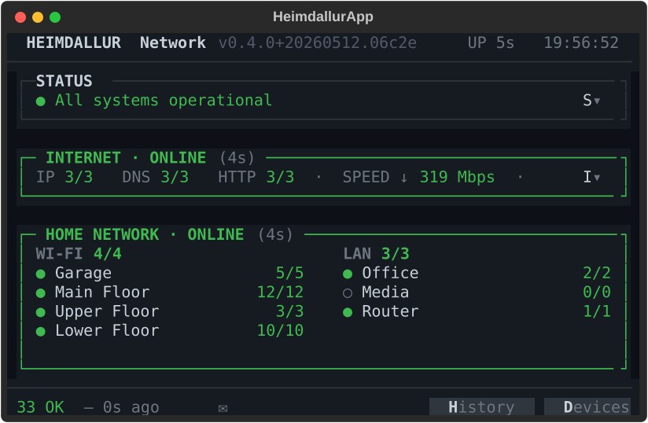 |
|:---:|

---

### Internet degraded

Latency is elevated and packet loss is intermittent, but connectivity is maintained. The Internet panel changes colour and the rolling-average summary reflects the degraded quality; the status banner expands to name the fault.

| 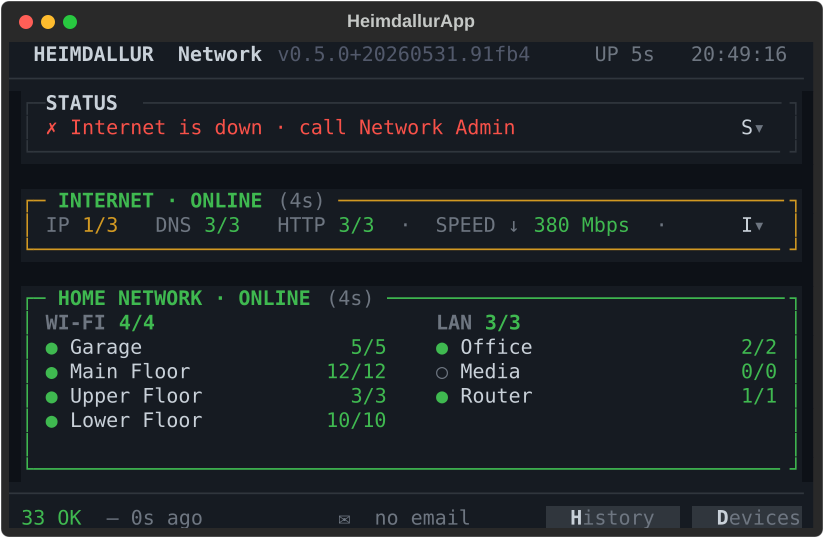 |
|:---:|

<!-- generated:internet_degraded:start -->
<details>
<summary>Web UI (<code>make web</code>)</summary>

| 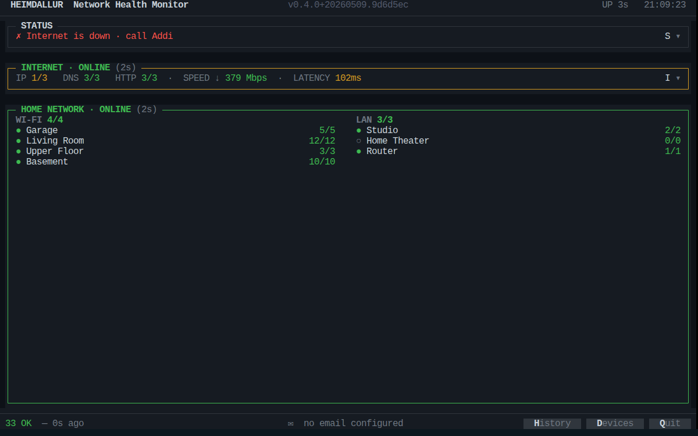 |
|:---:|

</details>

<details>
<summary>Status output (<code>--mode status</code>)</summary>

```text

HEIMDALLUR  2026-05-31 20:47:20 UTC

INTERNET  ~ Degraded  78ms  elevated
  IP 1/3  ·  DNS 3/3  ·  HTTP 3/3
  Some IP paths degraded — routing or congestion issue
  ↓ 274 Mbps  ·  ping 30 ms  (0s ago)

HOME NETWORK
  ROUTER  ✓ Online  1ms
  ✓ Online  4ms  WiFi Garage
  ✓ Online  1ms  WiFi Main Floor
  ✓ Online  4ms  WiFi Upper Floor
  ✓ Online  4ms  WiFi Lower Floor
  LAN  LAN Office
  LAN  LAN Media
  LAN  LAN Router

All monitored devices OK

33 monitored  ·  33 OK  ·  0 down
```

</details>

<details>
<summary>Markdown report (<code>--mode report</code>)</summary>

# Heimdallur Network Status

**Probed:** 2026-05-31 20:47:20 UTC  |  **Interval:** 30s

## Summary

⚠️  1 issue(s) detected — 33 / 33 devices online

- Internet offline — full network unreachable

---

## Internet

**Status:** ❌ UNREACHABLE  |  **Latency (ONT):** 123 ms avg (degraded)  |  **Loss:** 0%

### IP Reachability

| Target | Status | Latency |
|--------|--------|---------|
| Cloudflare (1.1.1.1) | ❌ unreachable | 182 ms |
| Google (8.8.8.8) | ❌ unreachable | 139 ms |
| Quad9 (9.9.9.9) | ❌ unreachable | 195 ms |

### DNS

| Resolver | Status | Lookup |
|----------|--------|--------|
| Cloudflare (cloudflare.com) | ✅ Online | 100 ms |
| Google (google.com) | ✅ Online | 121 ms |
| Quad9 (quad9.net) | ✅ Online | 121 ms |

### HTTP

| Endpoint | Status | TTFB | Total |
|----------|--------|------|-------|
| Cloudflare | ✅ Online | 360 ms | 387 ms |
| Google | ✅ Online | 365 ms | 413 ms |
| Microsoft | ✅ Online | 301 ms | 356 ms |

**Speed test:** ↓ 189 Mbps  |  ping 22 ms  *(0s ago)*

---

## Home Network

### Router

**Status:** ✅ HEALTHY  |  **Latency:** 3 ms
**CPU:** 6%  |  **Memory:** 49%  |  **Uptime:** 3d

### Groups

#### WiFi Garage

**Gateway `192.0.2.25`:** ✅ 3 ms

**Devices:** 4 / 4 online

| Device | IP | Status | Latency |
|--------|----|--------|---------|
| Garage Door Controller | `192.0.2.100` | ✅ healthy | 4 ms |
| Garage Light | `192.0.2.101` | ✅ healthy | 2 ms |
| Utility Meter | `192.0.2.102` | ✅ healthy | 2 ms |
| Workbench Plug | `192.0.2.103` | ✅ healthy | 4 ms |

#### WiFi Main Floor

**Gateway `192.0.2.21`:** ✅ 4 ms

**Devices:** 11 / 11 online

| Device | IP | Status | Latency |
|--------|----|--------|---------|
| Entry Light | `192.0.2.110` | ✅ healthy | 1 ms |
| Kitchen Ceiling Light | `192.0.2.111` | ✅ healthy | 2 ms |
| Kitchen Counter Light | `192.0.2.112` | ✅ healthy | 5 ms |
| Dining Room Light | `192.0.2.113` | ✅ healthy | 4 ms |
| Living Room Light 1 | `192.0.2.114` | ✅ healthy | 2 ms |
| Living Room Light 2 | `192.0.2.115` | ✅ healthy | 1 ms |
| Living Room Light 3 | `192.0.2.116` | ✅ healthy | 3 ms |
| Hallway Light | `192.0.2.117` | ✅ healthy | 2 ms |
| Porch Light | `192.0.2.118` | ✅ healthy | 4 ms |
| Plant Light | `192.0.2.119` | ✅ healthy | 2 ms |
| Coffee Maker | `192.0.2.120` | ✅ healthy | 4 ms |

#### WiFi Upper Floor

**Gateway `192.0.2.22`:** ✅ 3 ms

**Devices:** 2 / 2 online

| Device | IP | Status | Latency |
|--------|----|--------|---------|
| Bathroom LED | `192.0.2.130` | ✅ healthy | 1 ms |
| Thermostat | `192.0.2.131` | ✅ healthy | 2 ms |

#### WiFi Lower Floor

**Gateway `192.0.2.23`:** ✅ 3 ms

**Devices:** 9 / 9 online

| Device | IP | Status | Latency |
|--------|----|--------|---------|
| Bedroom Light 1 | `192.0.2.140` | ✅ healthy | 1 ms |
| Bedroom Light 2 | `192.0.2.141` | ✅ healthy | 2 ms |
| Lower Bathroom Light | `192.0.2.142` | ✅ healthy | 1 ms |
| Media Room Light | `192.0.2.143` | ✅ healthy | 2 ms |
| Laundry Fan | `192.0.2.144` | ✅ healthy | 4 ms |
| Laundry Room Light | `192.0.2.145` | ✅ healthy | 2 ms |
| Storage Room Light | `192.0.2.146` | ✅ healthy | 1 ms |
| Patio Light | `192.0.2.147` | ✅ healthy | 4 ms |
| Patio Outlet | `192.0.2.148` | ✅ healthy | 3 ms |

#### LAN Office

**Devices:** 2 / 2 online

| Device | IP | Status | Latency |
|--------|----|--------|---------|
| Office Workstation | `192.0.2.132` | ✅ healthy | 2 ms |
| Automation Server | `192.0.2.64` | ✅ healthy | 1 ms |

#### LAN Media

**Devices:** 0 / 0 online

#### LAN Router

**Devices:** 1 / 1 online

| Device | IP | Status | Latency |
|--------|----|--------|---------|
| Network Controller | `192.0.2.151` | ✅ healthy | 4 ms |


---

## All Devices

| Device | IP | Group | Status | Latency |
|--------|----|-------|--------|---------|
| Garage Door Controller | `192.0.2.100` | WiFi Garage | ✅ healthy | 4 ms |
| Garage Light | `192.0.2.101` | WiFi Garage | ✅ healthy | 2 ms |
| Utility Meter | `192.0.2.102` | WiFi Garage | ✅ healthy | 2 ms |
| Workbench Plug | `192.0.2.103` | WiFi Garage | ✅ healthy | 4 ms |
| Entry Light | `192.0.2.110` | WiFi Main Floor | ✅ healthy | 1 ms |
| Kitchen Ceiling Light | `192.0.2.111` | WiFi Main Floor | ✅ healthy | 2 ms |
| Kitchen Counter Light | `192.0.2.112` | WiFi Main Floor | ✅ healthy | 5 ms |
| Dining Room Light | `192.0.2.113` | WiFi Main Floor | ✅ healthy | 4 ms |
| Living Room Light 1 | `192.0.2.114` | WiFi Main Floor | ✅ healthy | 2 ms |
| Living Room Light 2 | `192.0.2.115` | WiFi Main Floor | ✅ healthy | 1 ms |
| Living Room Light 3 | `192.0.2.116` | WiFi Main Floor | ✅ healthy | 3 ms |
| Hallway Light | `192.0.2.117` | WiFi Main Floor | ✅ healthy | 2 ms |
| Porch Light | `192.0.2.118` | WiFi Main Floor | ✅ healthy | 4 ms |
| Plant Light | `192.0.2.119` | WiFi Main Floor | ✅ healthy | 2 ms |
| Coffee Maker | `192.0.2.120` | WiFi Main Floor | ✅ healthy | 4 ms |
| Bathroom LED | `192.0.2.130` | WiFi Upper Floor | ✅ healthy | 1 ms |
| Thermostat | `192.0.2.131` | WiFi Upper Floor | ✅ healthy | 2 ms |
| Office Workstation | `192.0.2.132` | LAN Office | ✅ healthy | 2 ms |
| Automation Server | `192.0.2.64` | LAN Office | ✅ healthy | 1 ms |
| Network Controller | `192.0.2.151` | LAN Router | ✅ healthy | 4 ms |
| Bedroom Light 1 | `192.0.2.140` | WiFi Lower Floor | ✅ healthy | 1 ms |
| Bedroom Light 2 | `192.0.2.141` | WiFi Lower Floor | ✅ healthy | 2 ms |
| Lower Bathroom Light | `192.0.2.142` | WiFi Lower Floor | ✅ healthy | 1 ms |
| Media Room Light | `192.0.2.143` | WiFi Lower Floor | ✅ healthy | 2 ms |
| Laundry Fan | `192.0.2.144` | WiFi Lower Floor | ✅ healthy | 4 ms |
| Laundry Room Light | `192.0.2.145` | WiFi Lower Floor | ✅ healthy | 2 ms |
| Storage Room Light | `192.0.2.146` | WiFi Lower Floor | ✅ healthy | 1 ms |
| Patio Light | `192.0.2.147` | WiFi Lower Floor | ✅ healthy | 4 ms |
| Patio Outlet | `192.0.2.148` | WiFi Lower Floor | ✅ healthy | 3 ms |

---

*Generated by Heimdallur · DB: `~/.local/share/heimdallur/events.db`*

</details>
<!-- generated:internet_degraded:end -->

---

### Internet offline

Complete loss of internet connectivity — IP, DNS, and HTTP checks all failing. The Internet panel shows `✗ OFFLINE` and the status banner surfaces the diagnosis.

| 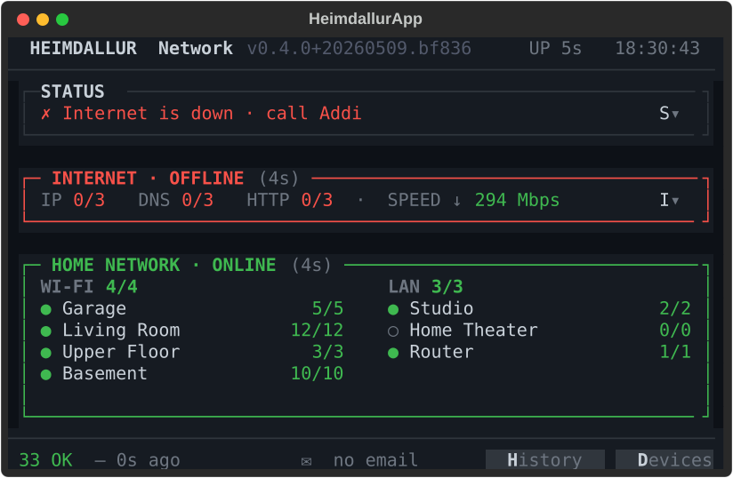 |
|:---:|

<!-- generated:internet_offline:start -->
<details>
<summary>Web UI (<code>make web</code>)</summary>

| 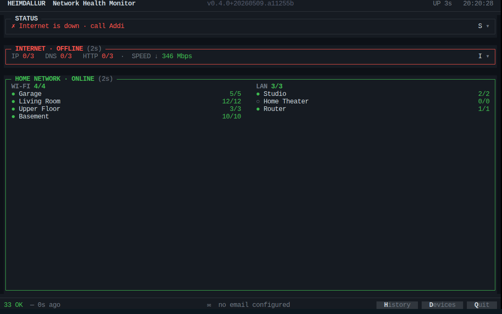 |
|:---:|

</details>

<details>
<summary>Status output (<code>--mode status</code>)</summary>

```text

HEIMDALLUR  2026-05-31 20:47:20 UTC

INTERNET  ✗ Offline  timeout
  IP 0/3  ·  DNS 0/3  ·  HTTP 0/3
  No IP connectivity — likely ISP outage
  ↓ 247 Mbps  ·  ping 21 ms  (0s ago)

HOME NETWORK
  ROUTER  ✓ Online  2ms
  ✓ Online  2ms  WiFi Garage
  ✓ Online  5ms  WiFi Main Floor
  ✓ Online  1ms  WiFi Upper Floor
  ✓ Online  3ms  WiFi Lower Floor
  LAN  LAN Office
  LAN  LAN Media
  LAN  LAN Router

PROBLEMS
  ✗  Internet offline — full network unreachable

33 monitored  ·  33 OK  ·  0 down
```

</details>

<details>
<summary>Markdown report (<code>--mode report</code>)</summary>

# Heimdallur Network Status

**Probed:** 2026-05-31 20:47:21 UTC  |  **Interval:** 30s

## Summary

⚠️  1 issue(s) detected — 33 / 33 devices online

- Internet offline — full network unreachable

---

## Internet

**Status:** ❌ UNREACHABLE  |  **Latency (ONT):** — avg  |  **Loss:** 100%

### IP Reachability

| Target | Status | Latency |
|--------|--------|---------|
| Cloudflare (1.1.1.1) | ❌ unreachable | — |
| Google (8.8.8.8) | ❌ unreachable | — |
| Quad9 (9.9.9.9) | ❌ unreachable | — |

### DNS

| Resolver | Status | Lookup |
|----------|--------|--------|
| Cloudflare (cloudflare.com) | ❌ Offline | — |
| Google (google.com) | ❌ Offline | — |
| Quad9 (quad9.net) | ❌ Offline | — |

### HTTP

| Endpoint | Status | TTFB | Total |
|----------|--------|------|-------|
| Cloudflare | ❌ Offline | — | — |
| Google | ❌ Offline | — | — |
| Microsoft | ❌ Offline | — | — |

**Speed test:** ↓ 239 Mbps  |  ping 10 ms  *(0s ago)*

---

## Home Network

### Router

**Status:** ✅ HEALTHY  |  **Latency:** 2 ms
**CPU:** 13%  |  **Memory:** 32%  |  **Uptime:** 3d

### Groups

#### WiFi Garage

**Gateway `192.0.2.25`:** ✅ 1 ms

**Devices:** 4 / 4 online

| Device | IP | Status | Latency |
|--------|----|--------|---------|
| Garage Door Controller | `192.0.2.100` | ✅ healthy | 3 ms |
| Garage Light | `192.0.2.101` | ✅ healthy | 2 ms |
| Utility Meter | `192.0.2.102` | ✅ healthy | 1 ms |
| Workbench Plug | `192.0.2.103` | ✅ healthy | 1 ms |

#### WiFi Main Floor

**Gateway `192.0.2.21`:** ✅ 1 ms

**Devices:** 11 / 11 online

| Device | IP | Status | Latency |
|--------|----|--------|---------|
| Entry Light | `192.0.2.110` | ✅ healthy | 2 ms |
| Kitchen Ceiling Light | `192.0.2.111` | ✅ healthy | 1 ms |
| Kitchen Counter Light | `192.0.2.112` | ✅ healthy | 3 ms |
| Dining Room Light | `192.0.2.113` | ✅ healthy | 4 ms |
| Living Room Light 1 | `192.0.2.114` | ✅ healthy | 2 ms |
| Living Room Light 2 | `192.0.2.115` | ✅ healthy | 1 ms |
| Living Room Light 3 | `192.0.2.116` | ✅ healthy | 2 ms |
| Hallway Light | `192.0.2.117` | ✅ healthy | 3 ms |
| Porch Light | `192.0.2.118` | ✅ healthy | 4 ms |
| Plant Light | `192.0.2.119` | ✅ healthy | 3 ms |
| Coffee Maker | `192.0.2.120` | ✅ healthy | 4 ms |

#### WiFi Upper Floor

**Gateway `192.0.2.22`:** ✅ 2 ms

**Devices:** 2 / 2 online

| Device | IP | Status | Latency |
|--------|----|--------|---------|
| Bathroom LED | `192.0.2.130` | ✅ healthy | 2 ms |
| Thermostat | `192.0.2.131` | ✅ healthy | 5 ms |

#### WiFi Lower Floor

**Gateway `192.0.2.23`:** ✅ 3 ms

**Devices:** 9 / 9 online

| Device | IP | Status | Latency |
|--------|----|--------|---------|
| Bedroom Light 1 | `192.0.2.140` | ✅ healthy | 3 ms |
| Bedroom Light 2 | `192.0.2.141` | ✅ healthy | 2 ms |
| Lower Bathroom Light | `192.0.2.142` | ✅ healthy | 3 ms |
| Media Room Light | `192.0.2.143` | ✅ healthy | 5 ms |
| Laundry Fan | `192.0.2.144` | ✅ healthy | 3 ms |
| Laundry Room Light | `192.0.2.145` | ✅ healthy | 2 ms |
| Storage Room Light | `192.0.2.146` | ✅ healthy | 2 ms |
| Patio Light | `192.0.2.147` | ✅ healthy | 4 ms |
| Patio Outlet | `192.0.2.148` | ✅ healthy | 3 ms |

#### LAN Office

**Devices:** 2 / 2 online

| Device | IP | Status | Latency |
|--------|----|--------|---------|
| Office Workstation | `192.0.2.132` | ✅ healthy | 1 ms |
| Automation Server | `192.0.2.64` | ✅ healthy | 1 ms |

#### LAN Media

**Devices:** 0 / 0 online

#### LAN Router

**Devices:** 1 / 1 online

| Device | IP | Status | Latency |
|--------|----|--------|---------|
| Network Controller | `192.0.2.151` | ✅ healthy | 4 ms |


---

## All Devices

| Device | IP | Group | Status | Latency |
|--------|----|-------|--------|---------|
| Garage Door Controller | `192.0.2.100` | WiFi Garage | ✅ healthy | 3 ms |
| Garage Light | `192.0.2.101` | WiFi Garage | ✅ healthy | 2 ms |
| Utility Meter | `192.0.2.102` | WiFi Garage | ✅ healthy | 1 ms |
| Workbench Plug | `192.0.2.103` | WiFi Garage | ✅ healthy | 1 ms |
| Entry Light | `192.0.2.110` | WiFi Main Floor | ✅ healthy | 2 ms |
| Kitchen Ceiling Light | `192.0.2.111` | WiFi Main Floor | ✅ healthy | 1 ms |
| Kitchen Counter Light | `192.0.2.112` | WiFi Main Floor | ✅ healthy | 3 ms |
| Dining Room Light | `192.0.2.113` | WiFi Main Floor | ✅ healthy | 4 ms |
| Living Room Light 1 | `192.0.2.114` | WiFi Main Floor | ✅ healthy | 2 ms |
| Living Room Light 2 | `192.0.2.115` | WiFi Main Floor | ✅ healthy | 1 ms |
| Living Room Light 3 | `192.0.2.116` | WiFi Main Floor | ✅ healthy | 2 ms |
| Hallway Light | `192.0.2.117` | WiFi Main Floor | ✅ healthy | 3 ms |
| Porch Light | `192.0.2.118` | WiFi Main Floor | ✅ healthy | 4 ms |
| Plant Light | `192.0.2.119` | WiFi Main Floor | ✅ healthy | 3 ms |
| Coffee Maker | `192.0.2.120` | WiFi Main Floor | ✅ healthy | 4 ms |
| Bathroom LED | `192.0.2.130` | WiFi Upper Floor | ✅ healthy | 2 ms |
| Thermostat | `192.0.2.131` | WiFi Upper Floor | ✅ healthy | 5 ms |
| Office Workstation | `192.0.2.132` | LAN Office | ✅ healthy | 1 ms |
| Automation Server | `192.0.2.64` | LAN Office | ✅ healthy | 1 ms |
| Network Controller | `192.0.2.151` | LAN Router | ✅ healthy | 4 ms |
| Bedroom Light 1 | `192.0.2.140` | WiFi Lower Floor | ✅ healthy | 3 ms |
| Bedroom Light 2 | `192.0.2.141` | WiFi Lower Floor | ✅ healthy | 2 ms |
| Lower Bathroom Light | `192.0.2.142` | WiFi Lower Floor | ✅ healthy | 3 ms |
| Media Room Light | `192.0.2.143` | WiFi Lower Floor | ✅ healthy | 5 ms |
| Laundry Fan | `192.0.2.144` | WiFi Lower Floor | ✅ healthy | 3 ms |
| Laundry Room Light | `192.0.2.145` | WiFi Lower Floor | ✅ healthy | 2 ms |
| Storage Room Light | `192.0.2.146` | WiFi Lower Floor | ✅ healthy | 2 ms |
| Patio Light | `192.0.2.147` | WiFi Lower Floor | ✅ healthy | 4 ms |
| Patio Outlet | `192.0.2.148` | WiFi Lower Floor | ✅ healthy | 3 ms |

---

*Generated by Heimdallur · DB: `~/.local/share/heimdallur/events.db`*

</details>
<!-- generated:internet_offline:end -->

---

### Router offline

The router is unreachable. Because all downstream devices depend on the router, every access point and device is shown as `UNKNOWN` rather than individually failed — fault cascade keeps the signal-to-noise ratio low and points to the root cause.

| 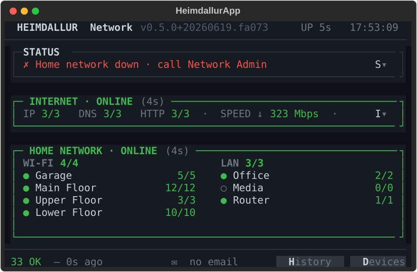 |
|:---:|

<!-- generated:router_offline:start -->
<details>
<summary>Web UI (<code>make web</code>)</summary>

| 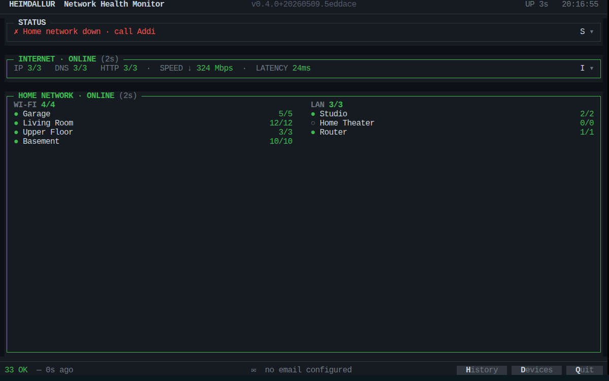 |
|:---:|

</details>

<details>
<summary>Status output (<code>--mode status</code>)</summary>

```text

HEIMDALLUR  2026-05-31 20:47:21 UTC

INTERNET  ✓ Online  36ms  excellent
  IP 3/3  ·  DNS 3/3  ·  HTTP 3/3
  All paths healthy
  ↓ 477 Mbps  ·  ping 25 ms  (0s ago)

HOME NETWORK
  ROUTER  ✗ Offline  timeout
  ✓ Online  1ms  WiFi Garage
  ✓ Online  3ms  WiFi Main Floor
  ✓ Online  3ms  WiFi Upper Floor
  ✓ Online  2ms  WiFi Lower Floor
  LAN  LAN Office
  LAN  LAN Media
  LAN  LAN Router

PROBLEMS
  ✗  Router offline — home network affected

33 monitored  ·  33 OK  ·  0 down
```

</details>

<details>
<summary>Markdown report (<code>--mode report</code>)</summary>

# Heimdallur Network Status

**Probed:** 2026-05-31 20:47:21 UTC  |  **Interval:** 30s

## Summary

⚠️  1 issue(s) detected — 33 / 33 devices online

- Router offline — home network affected

---

## Internet

**Status:** ✅ HEALTHY  |  **Latency (ONT):** 46 ms avg (excellent)  |  **Loss:** 0%

### IP Reachability

| Target | Status | Latency |
|--------|--------|---------|
| Cloudflare (1.1.1.1) | ✅ healthy | 14 ms |
| Google (8.8.8.8) | ✅ healthy | 26 ms |
| Quad9 (9.9.9.9) | ✅ healthy | 22 ms |

### DNS

| Resolver | Status | Lookup |
|----------|--------|--------|
| Cloudflare (cloudflare.com) | ✅ Online | 13 ms |
| Google (google.com) | ✅ Online | 12 ms |
| Quad9 (quad9.net) | ✅ Online | 14 ms |

### HTTP

| Endpoint | Status | TTFB | Total |
|----------|--------|------|-------|
| Cloudflare | ✅ Online | 75 ms | 92 ms |
| Google | ✅ Online | 62 ms | 70 ms |
| Microsoft | ✅ Online | 65 ms | 87 ms |

**Speed test:** ↓ 288 Mbps  |  ping 19 ms  *(0s ago)*

---

## Home Network

### Router

**Status:** ❌ UNREACHABLE  |  **Latency:** —
**CPU:** 20%  |  **Memory:** 35%  |  **Uptime:** 3d

### Groups

#### WiFi Garage

**Gateway `192.0.2.25`:** ✅ 4 ms

**Devices:** 4 / 4 online

| Device | IP | Status | Latency |
|--------|----|--------|---------|
| Garage Door Controller | `192.0.2.100` | ✅ healthy | 5 ms |
| Garage Light | `192.0.2.101` | ✅ healthy | 1 ms |
| Utility Meter | `192.0.2.102` | ✅ healthy | 3 ms |
| Workbench Plug | `192.0.2.103` | ✅ healthy | 5 ms |

#### WiFi Main Floor

**Gateway `192.0.2.21`:** ✅ 3 ms

**Devices:** 11 / 11 online

| Device | IP | Status | Latency |
|--------|----|--------|---------|
| Entry Light | `192.0.2.110` | ✅ healthy | 2 ms |
| Kitchen Ceiling Light | `192.0.2.111` | ✅ healthy | 4 ms |
| Kitchen Counter Light | `192.0.2.112` | ✅ healthy | 5 ms |
| Dining Room Light | `192.0.2.113` | ✅ healthy | 4 ms |
| Living Room Light 1 | `192.0.2.114` | ✅ healthy | 5 ms |
| Living Room Light 2 | `192.0.2.115` | ✅ healthy | 5 ms |
| Living Room Light 3 | `192.0.2.116` | ✅ healthy | 2 ms |
| Hallway Light | `192.0.2.117` | ✅ healthy | 1 ms |
| Porch Light | `192.0.2.118` | ✅ healthy | 5 ms |
| Plant Light | `192.0.2.119` | ✅ healthy | 3 ms |
| Coffee Maker | `192.0.2.120` | ✅ healthy | 4 ms |

#### WiFi Upper Floor

**Gateway `192.0.2.22`:** ✅ 3 ms

**Devices:** 2 / 2 online

| Device | IP | Status | Latency |
|--------|----|--------|---------|
| Bathroom LED | `192.0.2.130` | ✅ healthy | 3 ms |
| Thermostat | `192.0.2.131` | ✅ healthy | 5 ms |

#### WiFi Lower Floor

**Gateway `192.0.2.23`:** ✅ 1 ms

**Devices:** 9 / 9 online

| Device | IP | Status | Latency |
|--------|----|--------|---------|
| Bedroom Light 1 | `192.0.2.140` | ✅ healthy | 4 ms |
| Bedroom Light 2 | `192.0.2.141` | ✅ healthy | 2 ms |
| Lower Bathroom Light | `192.0.2.142` | ✅ healthy | 3 ms |
| Media Room Light | `192.0.2.143` | ✅ healthy | 3 ms |
| Laundry Fan | `192.0.2.144` | ✅ healthy | 3 ms |
| Laundry Room Light | `192.0.2.145` | ✅ healthy | 3 ms |
| Storage Room Light | `192.0.2.146` | ✅ healthy | 3 ms |
| Patio Light | `192.0.2.147` | ✅ healthy | 5 ms |
| Patio Outlet | `192.0.2.148` | ✅ healthy | 3 ms |

#### LAN Office

**Devices:** 2 / 2 online

| Device | IP | Status | Latency |
|--------|----|--------|---------|
| Office Workstation | `192.0.2.132` | ✅ healthy | 3 ms |
| Automation Server | `192.0.2.64` | ✅ healthy | 2 ms |

#### LAN Media

**Devices:** 0 / 0 online

#### LAN Router

**Devices:** 1 / 1 online

| Device | IP | Status | Latency |
|--------|----|--------|---------|
| Network Controller | `192.0.2.151` | ✅ healthy | 4 ms |


---

## All Devices

| Device | IP | Group | Status | Latency |
|--------|----|-------|--------|---------|
| Garage Door Controller | `192.0.2.100` | WiFi Garage | ✅ healthy | 5 ms |
| Garage Light | `192.0.2.101` | WiFi Garage | ✅ healthy | 1 ms |
| Utility Meter | `192.0.2.102` | WiFi Garage | ✅ healthy | 3 ms |
| Workbench Plug | `192.0.2.103` | WiFi Garage | ✅ healthy | 5 ms |
| Entry Light | `192.0.2.110` | WiFi Main Floor | ✅ healthy | 2 ms |
| Kitchen Ceiling Light | `192.0.2.111` | WiFi Main Floor | ✅ healthy | 4 ms |
| Kitchen Counter Light | `192.0.2.112` | WiFi Main Floor | ✅ healthy | 5 ms |
| Dining Room Light | `192.0.2.113` | WiFi Main Floor | ✅ healthy | 4 ms |
| Living Room Light 1 | `192.0.2.114` | WiFi Main Floor | ✅ healthy | 5 ms |
| Living Room Light 2 | `192.0.2.115` | WiFi Main Floor | ✅ healthy | 5 ms |
| Living Room Light 3 | `192.0.2.116` | WiFi Main Floor | ✅ healthy | 2 ms |
| Hallway Light | `192.0.2.117` | WiFi Main Floor | ✅ healthy | 1 ms |
| Porch Light | `192.0.2.118` | WiFi Main Floor | ✅ healthy | 5 ms |
| Plant Light | `192.0.2.119` | WiFi Main Floor | ✅ healthy | 3 ms |
| Coffee Maker | `192.0.2.120` | WiFi Main Floor | ✅ healthy | 4 ms |
| Bathroom LED | `192.0.2.130` | WiFi Upper Floor | ✅ healthy | 3 ms |
| Thermostat | `192.0.2.131` | WiFi Upper Floor | ✅ healthy | 5 ms |
| Office Workstation | `192.0.2.132` | LAN Office | ✅ healthy | 3 ms |
| Automation Server | `192.0.2.64` | LAN Office | ✅ healthy | 2 ms |
| Network Controller | `192.0.2.151` | LAN Router | ✅ healthy | 4 ms |
| Bedroom Light 1 | `192.0.2.140` | WiFi Lower Floor | ✅ healthy | 4 ms |
| Bedroom Light 2 | `192.0.2.141` | WiFi Lower Floor | ✅ healthy | 2 ms |
| Lower Bathroom Light | `192.0.2.142` | WiFi Lower Floor | ✅ healthy | 3 ms |
| Media Room Light | `192.0.2.143` | WiFi Lower Floor | ✅ healthy | 3 ms |
| Laundry Fan | `192.0.2.144` | WiFi Lower Floor | ✅ healthy | 3 ms |
| Laundry Room Light | `192.0.2.145` | WiFi Lower Floor | ✅ healthy | 3 ms |
| Storage Room Light | `192.0.2.146` | WiFi Lower Floor | ✅ healthy | 3 ms |
| Patio Light | `192.0.2.147` | WiFi Lower Floor | ✅ healthy | 5 ms |
| Patio Outlet | `192.0.2.148` | WiFi Lower Floor | ✅ healthy | 3 ms |

---

*Generated by Heimdallur · DB: `~/.local/share/heimdallur/events.db`*

</details>
<!-- generated:router_offline:end -->

---

### AP offline

One access point (Basement) is down. Its nine downstream devices are suppressed to `UNKNOWN`, while all other groups remain unaffected. Only the root-cause AP is highlighted.

| 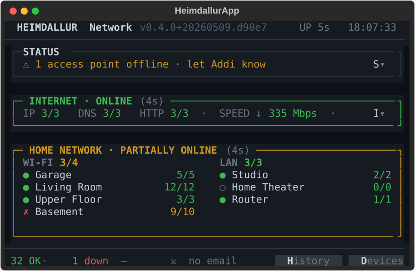 |
|:---:|

<!-- generated:gateway_offline:start -->
<details>
<summary>Web UI (<code>make web</code>)</summary>

| 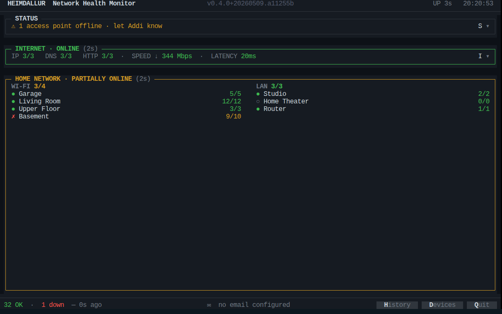 |
|:---:|

</details>

<details>
<summary>Status output (<code>--mode status</code>)</summary>

```text

HEIMDALLUR  2026-05-31 20:47:21 UTC

INTERNET  ✓ Online  41ms  excellent
  IP 3/3  ·  DNS 3/3  ·  HTTP 3/3
  All paths healthy
  ↓ 473 Mbps  ·  ping 9 ms  (0s ago)

HOME NETWORK
  ROUTER  ✓ Online  2ms
  ✓ Online  2ms  WiFi Garage
  ✓ Online  2ms  WiFi Main Floor
  ✓ Online  4ms  WiFi Upper Floor
  ✗ Offline  timeout  WiFi Lower Floor
  LAN  LAN Office
  LAN  LAN Media
  LAN  LAN Router

PROBLEMS
  ✗  WiFi Lower Floor WiFi access point offline — 9 devices affected

33 monitored  ·  32 OK  ·  1 down
```

</details>

<details>
<summary>Markdown report (<code>--mode report</code>)</summary>

# Heimdallur Network Status

**Probed:** 2026-05-31 20:47:21 UTC  |  **Interval:** 30s

## Summary

⚠️  1 issue(s) detected — 32 / 33 devices online

- WiFi Lower Floor WiFi access point offline — 9 devices affected

---

## Internet

**Status:** ✅ HEALTHY  |  **Latency (ONT):** 32 ms avg (excellent)  |  **Loss:** 0%

### IP Reachability

| Target | Status | Latency |
|--------|--------|---------|
| Cloudflare (1.1.1.1) | ✅ healthy | 23 ms |
| Google (8.8.8.8) | ✅ healthy | 33 ms |
| Quad9 (9.9.9.9) | ✅ healthy | 23 ms |

### DNS

| Resolver | Status | Lookup |
|----------|--------|--------|
| Cloudflare (cloudflare.com) | ✅ Online | 5 ms |
| Google (google.com) | ✅ Online | 13 ms |
| Quad9 (quad9.net) | ✅ Online | 16 ms |

### HTTP

| Endpoint | Status | TTFB | Total |
|----------|--------|------|-------|
| Cloudflare | ✅ Online | 55 ms | 74 ms |
| Google | ✅ Online | 52 ms | 71 ms |
| Microsoft | ✅ Online | 45 ms | 68 ms |

**Speed test:** ↓ 414 Mbps  |  ping 34 ms  *(0s ago)*

---

## Home Network

### Router

**Status:** ✅ HEALTHY  |  **Latency:** 2 ms
**CPU:** 7%  |  **Memory:** 35%  |  **Uptime:** 3d

### Groups

#### WiFi Garage

**Gateway `192.0.2.25`:** ✅ 1 ms

**Devices:** 4 / 4 online

| Device | IP | Status | Latency |
|--------|----|--------|---------|
| Garage Door Controller | `192.0.2.100` | ✅ healthy | 2 ms |
| Garage Light | `192.0.2.101` | ✅ healthy | 4 ms |
| Utility Meter | `192.0.2.102` | ✅ healthy | 2 ms |
| Workbench Plug | `192.0.2.103` | ✅ healthy | 4 ms |

#### WiFi Main Floor

**Gateway `192.0.2.21`:** ✅ 3 ms

**Devices:** 11 / 11 online

| Device | IP | Status | Latency |
|--------|----|--------|---------|
| Entry Light | `192.0.2.110` | ✅ healthy | 3 ms |
| Kitchen Ceiling Light | `192.0.2.111` | ✅ healthy | 2 ms |
| Kitchen Counter Light | `192.0.2.112` | ✅ healthy | 4 ms |
| Dining Room Light | `192.0.2.113` | ✅ healthy | 4 ms |
| Living Room Light 1 | `192.0.2.114` | ✅ healthy | 4 ms |
| Living Room Light 2 | `192.0.2.115` | ✅ healthy | 2 ms |
| Living Room Light 3 | `192.0.2.116` | ✅ healthy | 2 ms |
| Hallway Light | `192.0.2.117` | ✅ healthy | 1 ms |
| Porch Light | `192.0.2.118` | ✅ healthy | 5 ms |
| Plant Light | `192.0.2.119` | ✅ healthy | 1 ms |
| Coffee Maker | `192.0.2.120` | ✅ healthy | 5 ms |

#### WiFi Upper Floor

**Gateway `192.0.2.22`:** ✅ 5 ms

**Devices:** 2 / 2 online

| Device | IP | Status | Latency |
|--------|----|--------|---------|
| Bathroom LED | `192.0.2.130` | ✅ healthy | 3 ms |
| Thermostat | `192.0.2.131` | ✅ healthy | 3 ms |

#### WiFi Lower Floor

**Gateway `192.0.2.23`:** ❌ —

**Devices:** 9 / 9 online

| Device | IP | Status | Latency |
|--------|----|--------|---------|
| Bedroom Light 1 | `192.0.2.140` | ❓ unknown (gateway down) | — |
| Bedroom Light 2 | `192.0.2.141` | ❓ unknown (gateway down) | — |
| Lower Bathroom Light | `192.0.2.142` | ❓ unknown (gateway down) | — |
| Media Room Light | `192.0.2.143` | ❓ unknown (gateway down) | — |
| Laundry Fan | `192.0.2.144` | ❓ unknown (gateway down) | — |
| Laundry Room Light | `192.0.2.145` | ❓ unknown (gateway down) | — |
| Storage Room Light | `192.0.2.146` | ❓ unknown (gateway down) | — |
| Patio Light | `192.0.2.147` | ❓ unknown (gateway down) | — |
| Patio Outlet | `192.0.2.148` | ❓ unknown (gateway down) | — |

#### LAN Office

**Devices:** 2 / 2 online

| Device | IP | Status | Latency |
|--------|----|--------|---------|
| Office Workstation | `192.0.2.132` | ✅ healthy | 3 ms |
| Automation Server | `192.0.2.64` | ✅ healthy | 2 ms |

#### LAN Media

**Devices:** 0 / 0 online

#### LAN Router

**Devices:** 1 / 1 online

| Device | IP | Status | Latency |
|--------|----|--------|---------|
| Network Controller | `192.0.2.151` | ✅ healthy | 1 ms |


---

## All Devices

| Device | IP | Group | Status | Latency |
|--------|----|-------|--------|---------|
| Garage Door Controller | `192.0.2.100` | WiFi Garage | ✅ healthy | 2 ms |
| Garage Light | `192.0.2.101` | WiFi Garage | ✅ healthy | 4 ms |
| Utility Meter | `192.0.2.102` | WiFi Garage | ✅ healthy | 2 ms |
| Workbench Plug | `192.0.2.103` | WiFi Garage | ✅ healthy | 4 ms |
| Entry Light | `192.0.2.110` | WiFi Main Floor | ✅ healthy | 3 ms |
| Kitchen Ceiling Light | `192.0.2.111` | WiFi Main Floor | ✅ healthy | 2 ms |
| Kitchen Counter Light | `192.0.2.112` | WiFi Main Floor | ✅ healthy | 4 ms |
| Dining Room Light | `192.0.2.113` | WiFi Main Floor | ✅ healthy | 4 ms |
| Living Room Light 1 | `192.0.2.114` | WiFi Main Floor | ✅ healthy | 4 ms |
| Living Room Light 2 | `192.0.2.115` | WiFi Main Floor | ✅ healthy | 2 ms |
| Living Room Light 3 | `192.0.2.116` | WiFi Main Floor | ✅ healthy | 2 ms |
| Hallway Light | `192.0.2.117` | WiFi Main Floor | ✅ healthy | 1 ms |
| Porch Light | `192.0.2.118` | WiFi Main Floor | ✅ healthy | 5 ms |
| Plant Light | `192.0.2.119` | WiFi Main Floor | ✅ healthy | 1 ms |
| Coffee Maker | `192.0.2.120` | WiFi Main Floor | ✅ healthy | 5 ms |
| Bathroom LED | `192.0.2.130` | WiFi Upper Floor | ✅ healthy | 3 ms |
| Thermostat | `192.0.2.131` | WiFi Upper Floor | ✅ healthy | 3 ms |
| Office Workstation | `192.0.2.132` | LAN Office | ✅ healthy | 3 ms |
| Automation Server | `192.0.2.64` | LAN Office | ✅ healthy | 2 ms |
| Network Controller | `192.0.2.151` | LAN Router | ✅ healthy | 1 ms |
| Bedroom Light 1 | `192.0.2.140` | WiFi Lower Floor | ❓ unknown | — |
| Bedroom Light 2 | `192.0.2.141` | WiFi Lower Floor | ❓ unknown | — |
| Lower Bathroom Light | `192.0.2.142` | WiFi Lower Floor | ❓ unknown | — |
| Media Room Light | `192.0.2.143` | WiFi Lower Floor | ❓ unknown | — |
| Laundry Fan | `192.0.2.144` | WiFi Lower Floor | ❓ unknown | — |
| Laundry Room Light | `192.0.2.145` | WiFi Lower Floor | ❓ unknown | — |
| Storage Room Light | `192.0.2.146` | WiFi Lower Floor | ❓ unknown | — |
| Patio Light | `192.0.2.147` | WiFi Lower Floor | ❓ unknown | — |
| Patio Outlet | `192.0.2.148` | WiFi Lower Floor | ❓ unknown | — |

---

*Generated by Heimdallur · DB: `~/.local/share/heimdallur/events.db`*

</details>
<!-- generated:gateway_offline:end -->

---

### Multiple issues

A compound failure: an access point is offline, internet connectivity is degraded, and one device is flapping intermittently. The status banner lists every active fault; each affected panel reflects its own state independently.

| 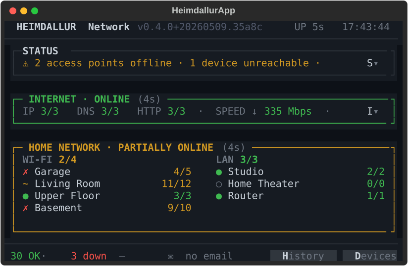 |
|:---:|

<!-- generated:multiple_issues:start -->
<details>
<summary>Web UI (<code>make web</code>)</summary>

| 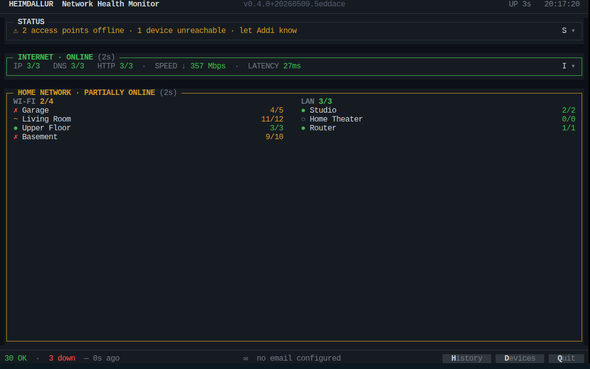 |
|:---:|

</details>

<details>
<summary>Status output (<code>--mode status</code>)</summary>

```text

HEIMDALLUR  2026-05-31 20:47:21 UTC

INTERNET  ✓ Online  21ms  excellent
  IP 3/3  ·  DNS 3/3  ·  HTTP 3/3
  All paths healthy
  ↓ 306 Mbps  ·  ping 13 ms  (0s ago)

HOME NETWORK
  ROUTER  ✓ Online  1ms
  ~ Degraded  82ms  WiFi Garage
  ✓ Online  2ms  WiFi Main Floor
  ✓ Online  2ms  WiFi Upper Floor
  ✗ Offline  timeout  WiFi Lower Floor
  LAN  LAN Office
  LAN  LAN Media
  LAN  LAN Router

PROBLEMS
  ✗  WiFi Lower Floor WiFi access point offline — 9 devices affected

33 monitored  ·  32 OK  ·  1 down
```

</details>

<details>
<summary>Markdown report (<code>--mode report</code>)</summary>

# Heimdallur Network Status

**Probed:** 2026-05-31 20:47:21 UTC  |  **Interval:** 30s

## Summary

⚠️  2 issue(s) detected — 31 / 33 devices online

- WiFi Garage WiFi access point offline — 4 devices affected
- WiFi Lower Floor WiFi access point offline — 9 devices affected

---

## Internet

**Status:** ✅ HEALTHY  |  **Latency (ONT):** 24 ms avg (excellent)  |  **Loss:** 0%

### IP Reachability

| Target | Status | Latency |
|--------|--------|---------|
| Cloudflare (1.1.1.1) | ✅ healthy | 25 ms |
| Google (8.8.8.8) | ✅ healthy | 26 ms |
| Quad9 (9.9.9.9) | ✅ healthy | 23 ms |

### DNS

| Resolver | Status | Lookup |
|----------|--------|--------|
| Cloudflare (cloudflare.com) | ✅ Online | 5 ms |
| Google (google.com) | ✅ Online | 3 ms |
| Quad9 (quad9.net) | ✅ Online | 12 ms |

### HTTP

| Endpoint | Status | TTFB | Total |
|----------|--------|------|-------|
| Cloudflare | ✅ Online | 58 ms | 64 ms |
| Google | ✅ Online | 87 ms | 104 ms |
| Microsoft | ✅ Online | 60 ms | 83 ms |

**Speed test:** ↓ 362 Mbps  |  ping 11 ms  *(0s ago)*

---

## Home Network

### Router

**Status:** ✅ HEALTHY  |  **Latency:** 3 ms
**CPU:** 11%  |  **Memory:** 50%  |  **Uptime:** 3d

### Groups

#### WiFi Garage

**Gateway `192.0.2.25`:** ❌ 172 ms

**Devices:** 4 / 4 online

| Device | IP | Status | Latency |
|--------|----|--------|---------|
| Garage Door Controller | `192.0.2.100` | ❓ unknown (gateway down) | — |
| Garage Light | `192.0.2.101` | ❓ unknown (gateway down) | — |
| Utility Meter | `192.0.2.102` | ❓ unknown (gateway down) | — |
| Workbench Plug | `192.0.2.103` | ❓ unknown (gateway down) | — |

#### WiFi Main Floor

**Gateway `192.0.2.21`:** ✅ 1 ms

**Devices:** 11 / 11 online

| Device | IP | Status | Latency |
|--------|----|--------|---------|
| Entry Light | `192.0.2.110` | ✅ healthy | 1 ms |
| Kitchen Ceiling Light | `192.0.2.111` | ✅ healthy | 3 ms |
| Kitchen Counter Light | `192.0.2.112` | ✅ healthy | 5 ms |
| Dining Room Light | `192.0.2.113` | ✅ healthy | 2 ms |
| Living Room Light 1 | `192.0.2.114` | ✅ healthy | 3 ms |
| Living Room Light 2 | `192.0.2.115` | ✅ healthy | 4 ms |
| Living Room Light 3 | `192.0.2.116` | ✅ healthy | 5 ms |
| Hallway Light | `192.0.2.117` | ✅ healthy | 1 ms |
| Porch Light | `192.0.2.118` | ✅ healthy | 1 ms |
| Plant Light | `192.0.2.119` | ✅ healthy | 2 ms |
| Coffee Maker | `192.0.2.120` | ✅ healthy | 6 ms |

#### WiFi Upper Floor

**Gateway `192.0.2.22`:** ✅ 1 ms

**Devices:** 2 / 2 online

| Device | IP | Status | Latency |
|--------|----|--------|---------|
| Bathroom LED | `192.0.2.130` | ✅ healthy | 2 ms |
| Thermostat | `192.0.2.131` | ✅ healthy | 1 ms |

#### WiFi Lower Floor

**Gateway `192.0.2.23`:** ❌ —

**Devices:** 9 / 9 online

| Device | IP | Status | Latency |
|--------|----|--------|---------|
| Bedroom Light 1 | `192.0.2.140` | ❓ unknown (gateway down) | — |
| Bedroom Light 2 | `192.0.2.141` | ❓ unknown (gateway down) | — |
| Lower Bathroom Light | `192.0.2.142` | ❓ unknown (gateway down) | — |
| Media Room Light | `192.0.2.143` | ❓ unknown (gateway down) | — |
| Laundry Fan | `192.0.2.144` | ❓ unknown (gateway down) | — |
| Laundry Room Light | `192.0.2.145` | ❓ unknown (gateway down) | — |
| Storage Room Light | `192.0.2.146` | ❓ unknown (gateway down) | — |
| Patio Light | `192.0.2.147` | ❓ unknown (gateway down) | — |
| Patio Outlet | `192.0.2.148` | ❓ unknown (gateway down) | — |

#### LAN Office

**Devices:** 2 / 2 online

| Device | IP | Status | Latency |
|--------|----|--------|---------|
| Office Workstation | `192.0.2.132` | ✅ healthy | 3 ms |
| Automation Server | `192.0.2.64` | ✅ healthy | 3 ms |

#### LAN Media

**Devices:** 0 / 0 online

#### LAN Router

**Devices:** 1 / 1 online

| Device | IP | Status | Latency |
|--------|----|--------|---------|
| Network Controller | `192.0.2.151` | ✅ healthy | 2 ms |


---

## All Devices

| Device | IP | Group | Status | Latency |
|--------|----|-------|--------|---------|
| Garage Door Controller | `192.0.2.100` | WiFi Garage | ❓ unknown | — |
| Garage Light | `192.0.2.101` | WiFi Garage | ❓ unknown | — |
| Utility Meter | `192.0.2.102` | WiFi Garage | ❓ unknown | — |
| Workbench Plug | `192.0.2.103` | WiFi Garage | ❓ unknown | — |
| Entry Light | `192.0.2.110` | WiFi Main Floor | ✅ healthy | 1 ms |
| Kitchen Ceiling Light | `192.0.2.111` | WiFi Main Floor | ✅ healthy | 3 ms |
| Kitchen Counter Light | `192.0.2.112` | WiFi Main Floor | ✅ healthy | 5 ms |
| Dining Room Light | `192.0.2.113` | WiFi Main Floor | ✅ healthy | 2 ms |
| Living Room Light 1 | `192.0.2.114` | WiFi Main Floor | ✅ healthy | 3 ms |
| Living Room Light 2 | `192.0.2.115` | WiFi Main Floor | ✅ healthy | 4 ms |
| Living Room Light 3 | `192.0.2.116` | WiFi Main Floor | ✅ healthy | 5 ms |
| Hallway Light | `192.0.2.117` | WiFi Main Floor | ✅ healthy | 1 ms |
| Porch Light | `192.0.2.118` | WiFi Main Floor | ✅ healthy | 1 ms |
| Plant Light | `192.0.2.119` | WiFi Main Floor | ✅ healthy | 2 ms |
| Coffee Maker | `192.0.2.120` | WiFi Main Floor | ✅ healthy | 6 ms |
| Bathroom LED | `192.0.2.130` | WiFi Upper Floor | ✅ healthy | 2 ms |
| Thermostat | `192.0.2.131` | WiFi Upper Floor | ✅ healthy | 1 ms |
| Office Workstation | `192.0.2.132` | LAN Office | ✅ healthy | 3 ms |
| Automation Server | `192.0.2.64` | LAN Office | ✅ healthy | 3 ms |
| Network Controller | `192.0.2.151` | LAN Router | ✅ healthy | 2 ms |
| Bedroom Light 1 | `192.0.2.140` | WiFi Lower Floor | ❓ unknown | — |
| Bedroom Light 2 | `192.0.2.141` | WiFi Lower Floor | ❓ unknown | — |
| Lower Bathroom Light | `192.0.2.142` | WiFi Lower Floor | ❓ unknown | — |
| Media Room Light | `192.0.2.143` | WiFi Lower Floor | ❓ unknown | — |
| Laundry Fan | `192.0.2.144` | WiFi Lower Floor | ❓ unknown | — |
| Laundry Room Light | `192.0.2.145` | WiFi Lower Floor | ❓ unknown | — |
| Storage Room Light | `192.0.2.146` | WiFi Lower Floor | ❓ unknown | — |
| Patio Light | `192.0.2.147` | WiFi Lower Floor | ❓ unknown | — |
| Patio Outlet | `192.0.2.148` | WiFi Lower Floor | ❓ unknown | — |

---

*Generated by Heimdallur · DB: `~/.local/share/heimdallur/events.db`*

</details>
<!-- generated:multiple_issues:end -->

---

### Status banner expanded

Press `s` to expand the top status banner into a full fault list. Each active problem is listed on its own line with a severity icon, giving a complete incident summary without leaving the main screen.

| 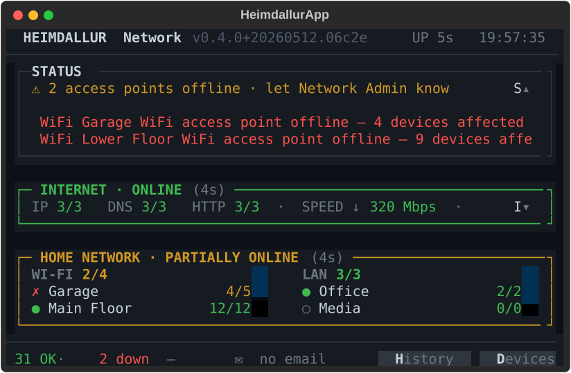 |
|:---:|

---

## Expanded panel views

Click any panel or press `i` (Internet) / `n` (Home Network) to expand it. The panel border subtitle changes from `▾` to `▴` and the detail view replaces the summary line.

---

### Internet panel — all healthy

The expanded Internet panel shows a latency sparkline, per-check results (IP reachability, DNS, HTTP) grouped by target, and the latest speed test reading with a historical average. Healthy targets are shown compactly; only degraded or failing targets get a detail row.

| 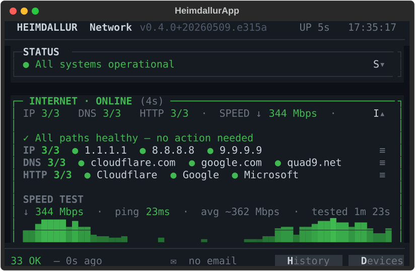 |
|:---:|

---

### Internet panel — partial failure

The same expanded view under a partial failure: one DNS resolver is failing while others pass, surfacing a plain-language diagnosis at the top of the panel ("All DNS failing — ISP resolver issue — try manual DNS").

| 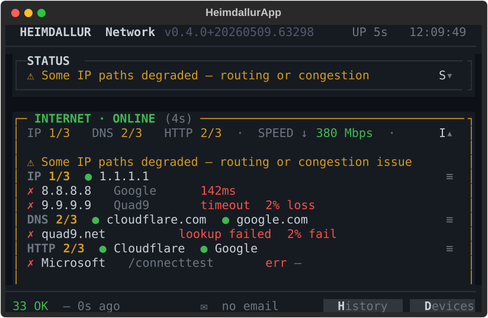 |
|:---:|

---

### Internet panel — offline

The expanded Internet panel when internet connectivity is fully lost. All check rows show failing status and the diagnosis banner at the top states the conclusion plainly so no further interpretation is needed.

| 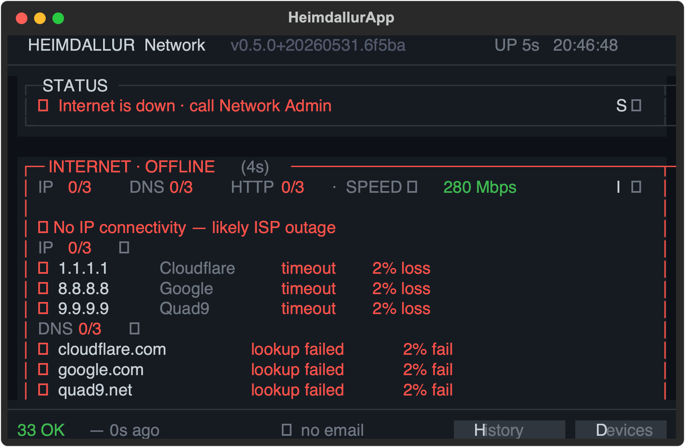 |
|:---:|

---

### Home network panel

The expanded Home Network panel shows router latency, memory usage, uptime, and per-group device counts. Each access point group lists its downstream devices with individual latency and online/offline status.

| 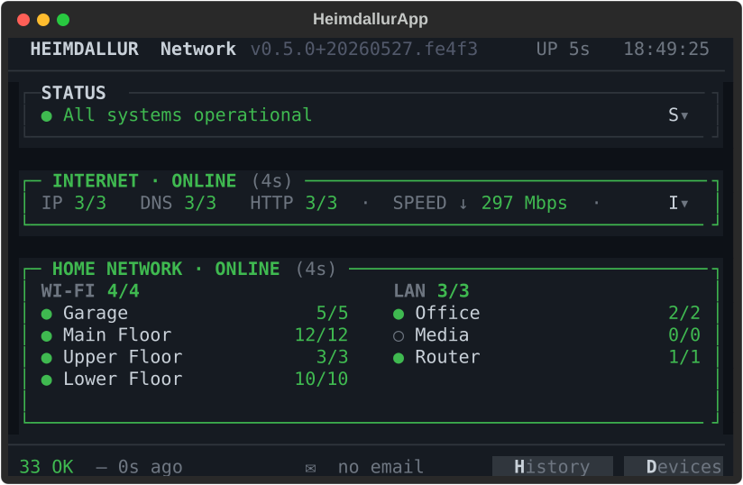 |
|:---:|

---

### Home network panel — AP offline

The same panel with an access point down. The affected group is highlighted; its downstream devices are listed as `UNKNOWN` rather than individually failed, confirming that the cascade suppression is working correctly.

| 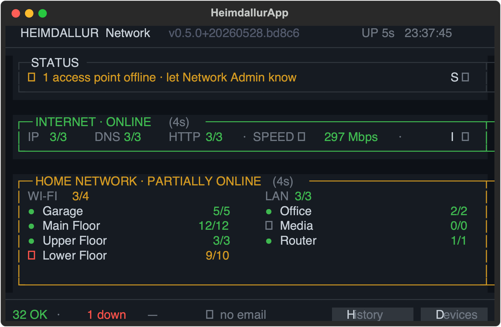 |
|:---:|

---

## Other screens

Press `h` for the history screen or `d` for the device list. Both screens are pushed onto the screen stack; press `q` or `Escape` to return to the status screen.

---

### History screen

24-hour uptime bars per network segment, updated on each probe cycle. Each bar represents a 30-minute window; colour indicates healthy / degraded / offline.

| 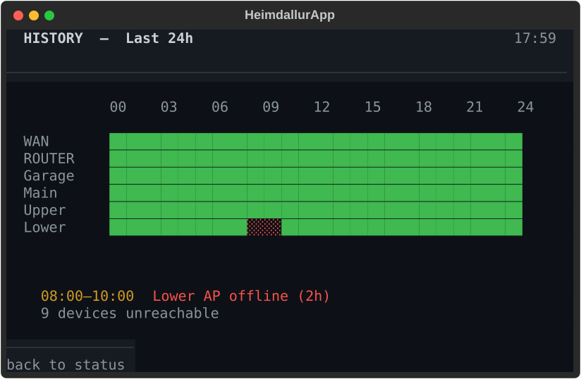 |
|:---:|

---

### Devices screen

Full device inventory with live latency and status per device, grouped by access point. Devices whose gateway is offline are shown as `UNKNOWN` rather than individually failed, consistent with the cascade logic on the status screen.

| 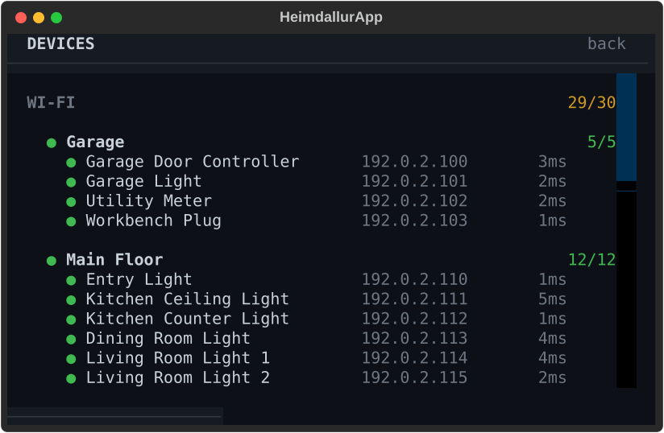 |
|:---:|
